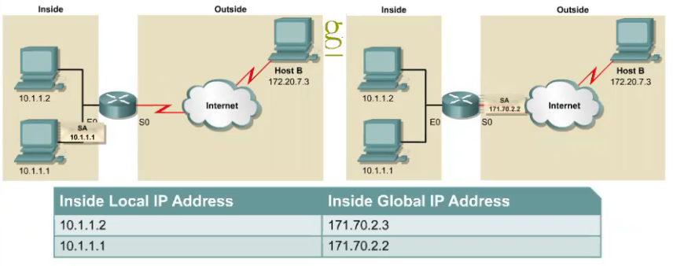
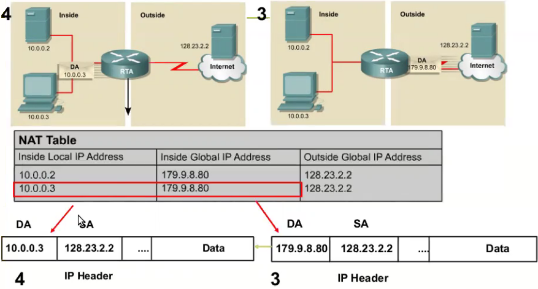
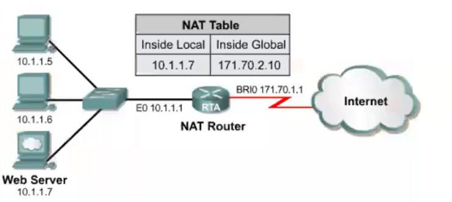
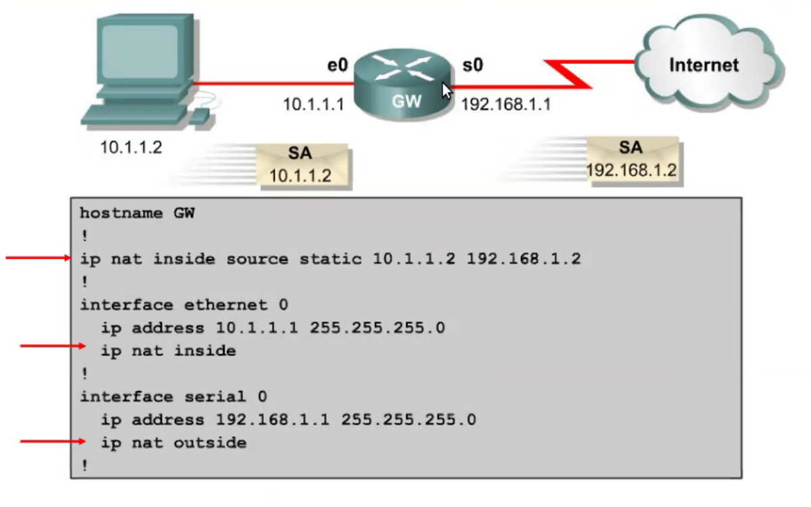
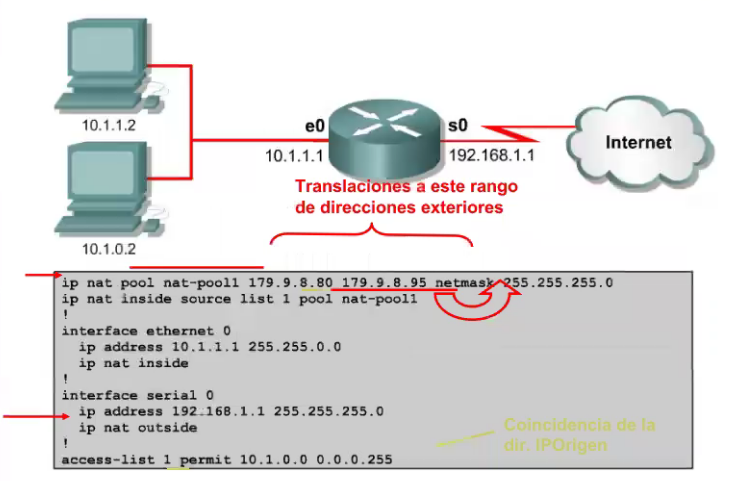
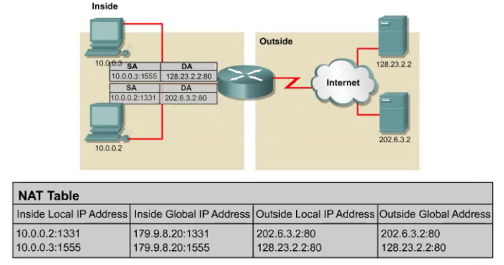
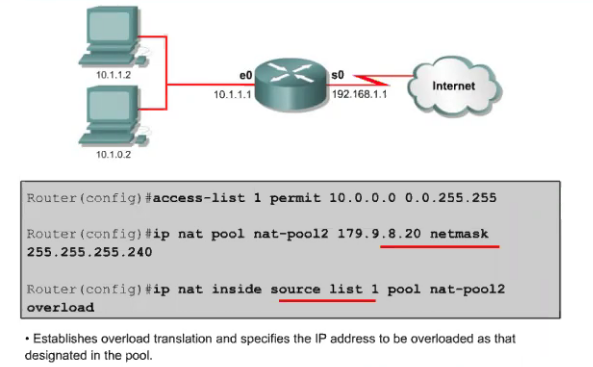
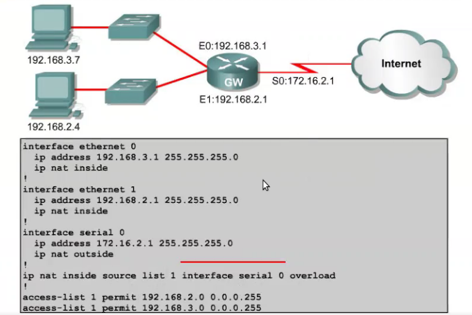

# Redes

## Clase 7 - NAT

### Introducción

No hubiera sido necesario implementar NAT si las IP públicas hubieras alcanzado. Este protocolo no es exclusivo de ipv4, sino que existe su implementación en ipv6. De hecho existen traducciones desde ipv4 a ipv6, aunque no sean tan eficientes ni brinden conexiones extremo a extremo.

### Motivaciones de NAT

+ Escasez de direcciones IP reales
+ Dificultad en obtener bloques
  + Necesidad de NICs regionales (ver [LACNIC](https://www.lacnic.net/))

> Reemplaza IPs privados por públicas
> Intercambio de IPs públicas (entre proveedor y router hogareño)

+ Asigna vatios bloques para uso interno y privado

```txt
10.0.0.0    - 10.255.255.255  (10/8 prefix)

172.16.0.0  - 172.31.255.255  (172.16/12 prefix) 16 redes disponibles en clase B

192.168.0.0 - 192.168.255.255 (192.168/16 prefix)
```

### Funciones

+ Translación de direcciones Internas Locales
  + NAT
+ Sobrecarga de direcciones Internas Globales
  + PAT
+ Distribución de carga TCP
  + Translación dinámica de las direcciones destino
+ Gestión de redes superpuestas
  + Se puede utilizar NAT para resolver problemas surgidos cuando direcciones internas se superponen con direcciones de la red externa.

<center>
  
</center>

> + **IPs interiores locales:** direcciones asignadas y configuradas a cualquier host que pertenece a la red local.
> + **IPs interiores globales:** dirección de un host como aparece en el exterior. La dirección *interna global* es la dirección que se traslada. Estas direcciones son las que el ISP o prestador del servicio nos asigna para poder acceder a Internet.

<center>
  
</center>

> Traslación de dirección IP Destino **Pública** a dirección IP Destino **Privada**.

### Tipos de NAT

#### Estático

A cada IP pública que tenga le asigno un IP privado. Nos salvaguarda del recambio de direcciones IP por parte del proveedor de DHCP.

<center>
  
</center>

> Una configuración de NAT estático permitirá a los hosts de Internet acceder al web server en `10.1.1.7` utilizando la dirección interna global `171.70.2.10`.

+ La traslación estática ocurre cuando una dirección está configurada en forma específica en la tabla de búsqueda.
+ Una dirección **interna local** se correlaciona específicamente con una dirección **interna global**.
+ Las direcciones **interna local** e **interna global** se mapean una a una.
+ Esto significa que por cada dirección **interna local** se requiere una dirección **interna global**.

##### Configuración de NAT Estático

Paso 1: *definir el mapeo estático*

```txt
Router(config)# ip nat inside source static <local-ip> <global-ip>
```

Paso 2: *especificar una interfaz interna*

```txt
Router(config)# interface <type> <number>
Router(config-if)# ip nat inside
```

Paso 3: *especificar una interfaz externa*

```txt
Router(config)# interface <type> <number>
Router(config-if)# ip nat outside
```

<center>
  
</center>

#### Dinámico

##### Configuración de NAT Dinámico

Paso 1: *crear una pool de direcciones globales*

```txt
Router(config)# ip nat pool <name> <start-ip> <end-ip> {netmask <netmask> | prefix-length <prefix-length>}
```

Paso 2: *crear una ACL para identificar los hosts a traducir*

```txt
Router(config)# access-list <access-list-number> permit source [source-wildcard]
```

Paso 3: *configurar NAT dinámico basado en la dirección de origen*

```txt
Router(config)# ip nat inside source list <access-list-number> pool <name>
```

Paso 4: *especificar una interfaz interna*

```txt
Router(config)# interface <type> <number>
Router(config-if)# ip nat inside
```

Paso 5: *especificar una interfaz externa*

```txt
Router(config)# interface <type> <number>
Router(config-if)# ip nat outside
```

<center>
  
</center>

### PAT (Port Address Translation)

+ Posibilita el uso de una única dirección pública y asignarla a hasta `65536` hosts internos.
+ El `PAT` modifica los peurtos origen `TCP/UDP`.
+ Múltiples direcciones IP provadas comaprten una sola dirección IP pública (muchos a uno).
+ Resuelve la limitación de NAT de translación uno a uno.

<center>
  
</center>

#### Configuración PAT (Cisco)

<center>
  
</center>

> En éste ejemplo solo se utiliza una dirección IP pública, via PAT. Los puertos origen valen para diferenciar diferentes flujos de conexión.

<center>
  
</center>

> Otra configuración PAT con más clientes en la red interna.

---

## Port Forwarding

Servicio que permite acceso limitado a la LAN interna desde el exterior

1. Source port (conexión desde el exterior)
2. 80 para web servers
3. 20 para FTP servers
4. 25 para mail servers
5. Destination IP (IP del servidor: 192.168.3.3)
6. Destination port (puerto configurado en el servidor)
