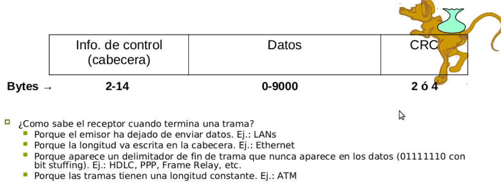
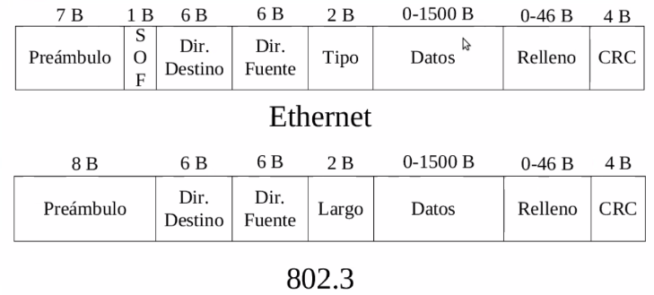
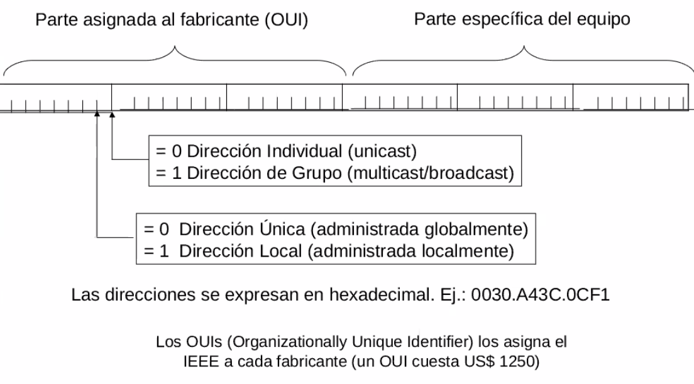
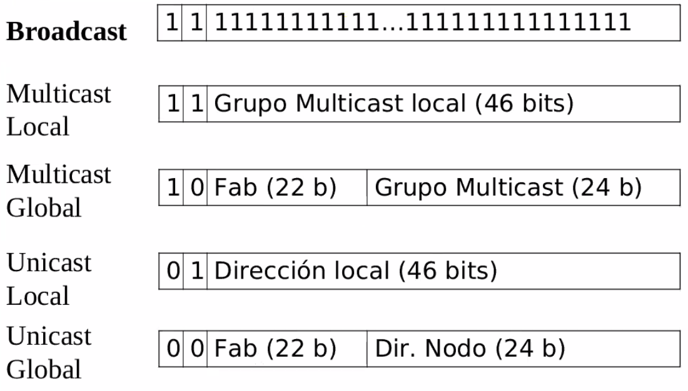
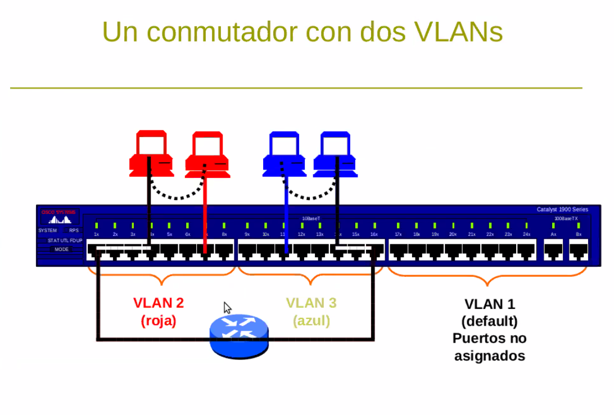
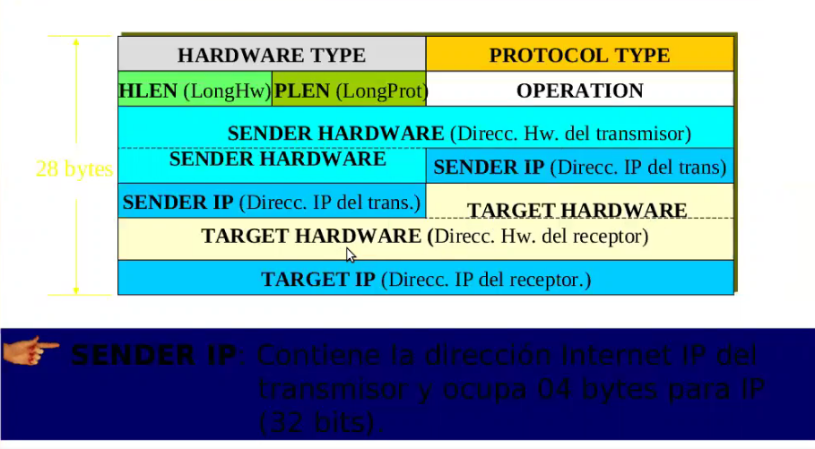
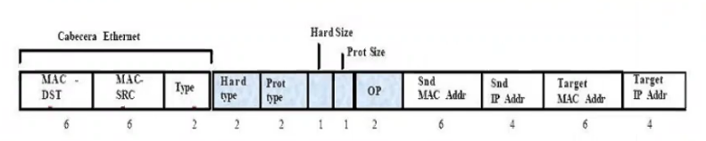

# Redes

## Clase 7 - Enlace de Datos - VLAN - ARP

### Introducción

Problema de Asignación del Canal de comunicación

+ Redes
  + Punto a punto: WANs
  + Broadcast: LANs
+ Broadcast: medio o canal compartido
  + conflictos
  + idnentificación
  + medio no siempre disponible
+ Capa 2 dividida: MAC y LLC

#### WAN

+ Canales  punto a punto (ascendentes y descendentes)

#### LAN

+ Limitación en al asignación de canal (asignación de IPs a máquinas en red de broadcasting)

#### Resolución del problema de asignación de canal

+ Asignación Estática
  + FDM
  + TDM
    + No aplicables a redes broadcast
+ Asignación Dinámica
+ Protocolos de contienda
+ Generan los protocolos de acceso al medio que operan en la subcapa MAC

### MAC (Media Access Control)

Tipos de protocolo:

+ Acceso múltiple sin detección de portadora
+ Acceso múltiple con detección de portadora
+ Libres de colisiones
+ De contienda limitada
+ Token Passing
+ Inalámbricos

### LLC (Logical Link Control)

+ Chequeo de frame
+ Pedido de retransmisión de tramas

### Carrier Sense Multiple Access con Detección Colisión (Ethernet)

> Cables de punta A a punto B, con una velocidad de propagación entre los puntos.

+ Estación sensa el canal, si está libre transmite frame; caso contrario se espera un tiempo aleatorio y se vuelve a sensar repitiendo el algoritmo. Una vez transmitido el frame se sensa el canal para detectar colisiones. En caso de existir una, se avisa con una señal.
+ Una colisión se producirá si dos o más nodos `Tx` al mismo tiempo o separados un instante de tiempo tal que la señal `Tx` no haya llegado al otro nodo (Período de Contienda)

Estados de una red CSMA/:

+ libre
+ transmisión
+ colisión

### Tipos de Enlaces

+ Simples: transmisión en un solo sentido (emisión de TV)
+ Semi-duplex o half-duplex: transmisión en ambos sentidos, pero no a la vez (walkie-talkies, redes WiFi, inalámbricas)
+ Dúplex o full-duplex: transmisión simultánea en ambos sentidos (conversación telefónica, ethernet, adsl)

En el caso Duplex y Semi-Duplex el enlace puede ser:

+ Simétrico: misma velocidad en ambos sentidos (Ethernet)
+ Asimétrico: diferente velocidad (Adsl)

### Velocidad de un enlace

+ Se especifica en bits por segundo (no bytes) usando prefijos métricos: bps, Kbps, Mbps, Gbps, Tbps.
  + `1 Kbps = 1.000 bps` (no 1.024 bps)
  + `1 Mbps = 1.000.000 bps` (no 1.024*1.021 bps)

### Tramas

> Genéricas para cualquier tipo de enlace

La capa de enlace transmite tramas. De formal general las tramas suelen tener la siguiente estructura:

  

#### Frames Ethernet/802.3

> 1, 10 y 100 Mbps

  

+ `Tipo` especifica protocolo nivel 3
+ `Largo` especifica el largo del campo datos

#### Encapsulamiento IEEE 802.3

  

### Direcciones MAC

+ Parte asignada al fabricante (OUI)
+ Parte específica del equipo

  

Tipos de direcciones IEEE de 48 bits

  

### Dispositivos LAN

+ Repetidores (físico)
+ Hubs (físico)
+ Bridges (físico)
  + saben leer colisiones
  + saben leer MAC address
+ Switch (físico)

## VLAN

Equivalen a partir un conmutador en varios más pequeños. Objetivos:

+ Rendimiento (reducir tráfico broadcast)
+ Seguridad: dentro de la misma LAN es muy dificil protegerse
+ Gestión

Normalmente la interconexión entre VLANs se hace con un router. Las VLANs están soportadas por la mayoría de los conmutadores actuales.

  

## ARP (Address Resolution Protocol)

> Protocolo auxiliar

Es un protocolo multi-protocolo que nos permite relacionar las direcciones IP con los valores de MAC address.

+ Transforma direcciones IP en direcciones físicas
+ ARP oculta las direcciones físicas
+ ARP es parte del sistema físico, no del protocolo TCP/IP
+ ARP sería innecesario si todo el hardware de red reconociera direcciones IP

> También es posible designar estáticamente las relaciones IP/MAC addres (evita ARP spoofing)

### Formato del protocolo ARP

  

### Trama ARP

  

+ **Type:** `0x0806` (*Trama ARP*)
+ **Hard type:** `1` (*Ethernet*)
+ **Prot. type:** `0x0800` (*IP*)
+ **Hard size:** `6` (*bytes dir. MAC*)
+ **Prot size:** `4` (*bytes dir. IP*)
+ **OP:** (*tipo de operación*)
  + `1`: ***ARP*** *request*
  + `2`: ***ARP*** *reply*
  + `3`: ***RARP*** *request*
  + `4`: ***RARP*** *reply*

#### RARP (Transformaciones inversas de direcciones)

Asigna una dirección IP y un esapcio para bajarse un sistema operativo para máquinas sin disco duro o almacenamiento.
Requiere que todas las máquinas que hagan solicitudes tengan una característico específica de hardware, por el tipo de servicio de software que brinda el servidor RARP.

Se descubre el servidor activo de RARP en la LAN y se ofrece una dirección IP y software.

+ Es utilizado por computadoras que no tienen disco duro, para obtener su IP
+ Es necesario disponer de un servidor RARP, que almacene direcciones IP y direcciones físicas
+ RARP utiliza el mismo formato que ARP
