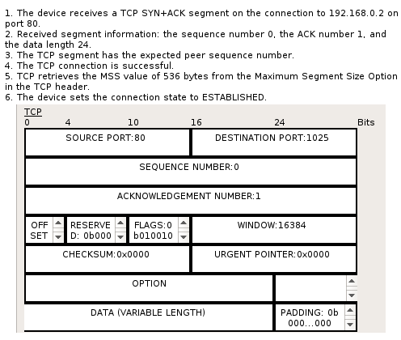
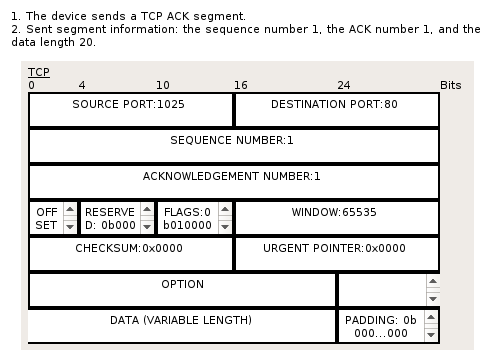
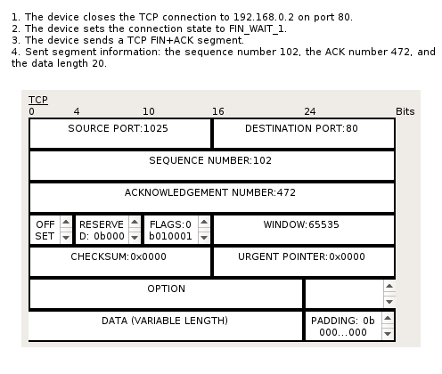
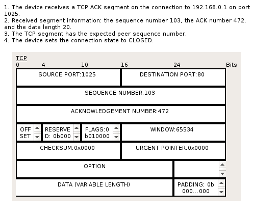

# Redes de Computadoras

> **Santiago Botta**

## Laboratorio 4 - Transporte

### Análisis

**1. ¿Cuál es el protocolo de aplicación que primero vemos? ¿Cuál es el protocolo de transporte utilizado?**

El primer protocolo de aplicación es `DNS`. El protocolo de Transporte utilizado es `UDP`, donde el puerto de origen es el `1028` y el puerto de origen es el `53`.

**2. Observando el flujo de datos entre la PC y el servidor: ¿Cuál es la relación que podemos encontrar dentro de las cabeceras del mensaje? ¿Se realiza o no una conexión? Representar entre cuales sockets se realiza el intercambio.**

En términos de flujo de datos entre **PC** y **servidor DNS** no se realiza ninguna conexión, la solicitud utiliza el protocolo **UDP** para la resolución de nombre `www.mipc.com`. El intercambio se da entre los sockets `192.168.0.1:1028` (pc) y `192.168.0.3:53` (server dns).

**3. En la cabecera de transporte el mensaje el campo DATA: ¿Qué representa? Represente el contenido que se transporta dentro del campo.**

El campo `DATA` representa el contenido la información que se transmite. En éste caso el valor transmitido es `(VARIABLE LENGTH)` en toda la ida y vuelta entre **PC** y **server DNS**.

**4. El mensaje que retorna desde el servidor a la PC: ¿Qué contenido trae en el protocolo de aplicación? ¿Qué cambio se observa en la cabecera de transporte?**

El protocolo aplicación trae una `DNS Answer` con `NAME: www.mipc.com`, `LENGTH: 4` e `IP: 192.168.0.2`.

Por otro lado, en la cabecera de **transporte** se observa un cambio en el parámetro `LENGTH: 0x0024`. Pero por sobre todo, el cambio más notable son los source y destination ports, que han cambiado por `SOURCE PORT: 53` **server DNS** y `DESTINATION PORT: 1028` **PC**, que expresa que el mensaje lo otorga el servidor dns hacia la pc.

**5. ¿Cuál es el Segundo protocolo de aplicación? ¿Cuál es el protocolo de transporte utilizado?**

El segundo protocolo de aplicación utilizado es `HTTP`, el protocolo de transporte utilizado es `TCP`.

**6. El flujo de datos entre la PC y el servidor: ¿Cuál es la relación que podemos encontrar dentro de las cabeceras del mensaje? ¿Se realiza o no una conexión? Representar entre cuales sockets se realiza el intercambio.**

Si nos referimos al flujo de datos entre **PC** y **servidor web**, las cabeceras llevan la carga de los números de `SECUENCIA` y `ACKNOWLEDGEMENT`, además de los puertos de `SOURCE` y `DESTINATION` correspondientes en la ida `SOURCE: 192.168.0.1:1028`, `DESTINATION: 192.168.0.2:80` y en la vuelta `SOURCE: 192.168.0.2:80`, `DESTINATION: 192.168.0.1:1028`

En éste caso se realiza una conexión, el intercambio se realiza entre los sockets `192.168.0.1:1028` (pc) y `192.168.0.2:80` (server web).

**7. ¿Se observa el saludo de 3 vías de TCP? ¿Estamos observando los mensajes de transporte?**

No, no están activados los mensajes de transporte, únicamente **DNS** y **HTTP**. Los mensajes de **UDP** y **TCP** permanecen ocultos. Si los descubrimos se puede observar:

+ Si, en un primer paso se observa como **PC** envía un segmento **TCP** con el flag `SYN` encendido (en la cabecera se observa `FLAGS: 0b000010`) y cambia su estado a `SYN_SENT`. Además envía `SEQUENCE NUMBER: 0` y `ACKNOWLEDGEMENT NUMBER: 0`.
+ Acto seguido, el host receptor (**server web**), recibe el pedido y cambia su estado a `SYN_RECEIVED`. A su vez, envía un segmento **TCP** con los flags `SYN+ACK` activados (en la cabecera se observa `FLAGS: 0b010010`), números de secuencia `SEQUENCE NUMBER: 0` y el acuse de recibo actualizado (+1) `ACKNOWLEDGEMENT NUMBER: 1`.
+ En un tercer paso se observa que el segmento recibido cuenta con el número de secuencia esperado, el dispositivo cambia su estado de conexión a `ESTABLISHED`. A su vez envía otro segmento **TCP** con el flag `ACK` activado (en la cabecera se observa `FLAGS: 0b010000`). Cuando el receptor **server web** reciba éste segmento cambiará su estado de conexión a `ESTABLISHED`.

**8. Habilitamos ambos protocolos de transporte y nos aparecerá en el historial los mensajes de trasporte que no estábamos observando: ¿Aparecen nuevos mensajes de ambos protocolos de transporte? En caso negativo, ¿De cuál es el que no vemos? ¿Por qué? Representar entre cuáles sockets se realiza el intercambio.**

Al habilitar los protocolos de transporte descubrimos mensajes de transporte **UDP** y **TCP**. Si continuamos con la ejecución hasta el final podemos observar nuevos mensajes de transporte **TCP** que corresponden al fin de sesión. Ya no observamos mensajes **UDP** porque se utilizaron únicamente para la resolución de nombres durante el intercambio de mensajes de aplicación **DNS**.

El intercambio de mensajes **TCP** se realizaa entre los sockets `192.168.0.1:1025` y `192.168.0.2:80`.

**9. ¿Cuáles son los ISN de la PC y el Server en el diálogo HTTP? ¿Qué flags están activos en el mensaje PC-SRV y cuáles en SRV-PC? . ¿A partir de qué número de secuencia de la PC podemos decir que la conexión está establecida? (Capture una imagen del mensaje).**

Asumo que por ISN nos referimos al *Initial Sequence Number*, elegido pseudoaleatoriamente por el software de **TCP** al momento de inicializar una conexión.
En el primer diálogo **HTTP** se observa que el número de secuencia enviado es `1`. El host **PC** envía éste segmento **TCP** a host **server web** con los flags `PUSH+ACK` activados, por su parte el servidor web también responde con éstos flags activados, en éste punto el valor de `ACK` incrementó a `102`. Los flags `PUSH+ACK` están representados en las cabeceras como `FLAGS: 0b011000`.
Podemos afirmar que la conexión **TCP** entre host **PC** y host **server web** se considerará como establecida recién después de que **PC** haya recibido el segmento con `SEQUENCE NUMBER: 0` y `ACKNOWLEDGEMENT NUMBER: 1` proveniente del host **server web**. Luego el estado de la conexión del lado cliente cambia a `ESTABLISHED` (Figura 1), y el host **PC** podrá comenzar a enviar segmentos (en éste caso el permiso de envío es posible porque el valor de ventana fue de `WINDOW: 16384`). Pero primero se envía un segmento de reconocimiento al host receptor (Figura 2) con `SEQUENCE NUMBER: 1`, `ACKNOWLEDGEMENT NUMBER: 1` y `FLAGS: 0b010000` (*ACK*). Entonces podemos decir que la conexión está establecida a partir del segmento con número de secuencia `1` enviado en éste último reconocimiento.

> Luego el host emisor está en condiciones de enviar un segmento con un pedido **HTTP** encapsulado, que viaja con `SEQUENCE NUMBER: 1`, `ACKNOWLEDGEMENT NUMBER: 1` y `FLAGS: 0b011000` (*PUSH+ACK*).

<div>
  <center>
    </center>
    <p style="padding-left:60px; padding-right:60px; margin-top:-5px; font-size:12px">
    <strong>Figura 1.</strong> Mensaje de entrada a host <strong>PC</strong> indicando que se recibe un segmento con los flags <code>SYN+ACK</code> activados, número de secuencia <code>0</code> y número de <code>ACK</code> con valor <code>1</code>. Luego el estado de conexión pasa a ser <strong>establecida</strong>
    </p>
  </center>
</div>

<div>
  <center>
    
    <p style="padding-left:60px; padding-right:60px; margin-top:-5px; font-size:12px">
    <strong>Figura 2.</strong> Primer mensaje de salida de host <strong>PC</strong> desde el establecimiento de conexión entre host <strong>PC</strong> y host <strong>server web</strong>. Representa un aviso que indica que se ha recibido el acuse de recibo mostrado anteriormente. Se envía un segmento con el flag <code>ACK</code> activado, número de secuencia <code>1</code> y número de <code>ACK</code> con valor <code>1</code>.
    </p>
  </center>
</div>

**10. ¿A partir de qué número de secuencia se inicia el cierre de la conexión? ¿Cuándo se da por cerrada? (Capture una imagen del mensaje).**

Una vez que TCP decide procesar la carga de su buffer, reemsambla todos los segmentos y los pasa a la capa superior.
En algún momento TCP cierra su conexión con `192.168.0.2` en el puerto `80`, cambia su estado a `FIN_WAIT_1` y envía un segmento con los flags `FIN+ACK` activados, representados en la cabecera como `FLAGS: 0b010001`, `SEQUENCE NUMBER: 102` y `ACKNOWLEDGEMENT NUMBER: 472`. Podemos observar que a partir del número de secuencia `102` se inicia el cierre de conexión (Figura 3).
El host **server web** recibe éste aviso de cierre, cambia su estado a `CLOSE_WAIT` y `LAST_ACK` y envía otro segmento con flags `SYN+ACK`, `SEQUENCE NUMBER: 472` y `ACKNOWLEDGEMENT NUMBER: 103` al host **PC**, indicando que recibió el aviso de cierre, pero aún va a esperar.
Por su parte, el host **PC** recibe éstos números de secuencia y acknowledgement, cambia su estado a `CLOSING` y envía un último segmento con el flags `ACK` activado, `SEQUENCE NUMBER: 103` y `ACKNOWLEDGEMENT NUMBER: 472`, indicado que la coenxión ya está siendo cerrada.
Por último, la conexión se da por cerrada cuando el host **server web** recibe éste segmento con esos números de secuencia y acknowledgemente y cambia su estado a `CLOSED` (Figura 4).

<div>
  <center>
    
    <p style="padding-left:60px; padding-right:60px; margin-top:-15px; font-size:12px">
    <strong>Figura 3.</strong> A partir del número de secuencia <code>102</code>, el dispositivo en host <strong>PC</strong> cierra la conexión <strong>TCP</strong> y envía un segmento con los flags <code>FIN+ACK</code> activados, indicando el inicio del cierre de conexión entre los hosts.
    </p>
  </center>
</div>

<div>
  <center>
    
    <p style="padding-left:60px; padding-right:60px; margin-top:-15px; font-size:12px">
    <strong>Figura 4.</strong> El <strong>servidor web</strong> recibe un último segmento de reconocimiento de cierre por parte del host <strong>PC</strong> y éste cambia su estado de conexión a <code>CLOSED</code>, a partir del número de secuencia <code>103</code>.
    </p>
  </center>
</div>

**11. Describa que da como resultado un netstat en el “Command Prompt” del servidor y del cliente.**

Para indicar el output del programa `netstat` se procede a enviar un pedido **HTTP** utiliando el modo simulación.
Para determinar el output del Servidor se ejecuta el comando `netstat` durante cada recibo de mensajes.
Respecto del estado estado de la máquina cliente, se procede de la siguiente manera:

+ Se activa el modo simulación.
+ Se abre un navegador y se visita la url `www.mipc.com`.
+ Acto seguido se vuelve a la sección `Desktop` y se selecciona `Command Promp`. En éste momento el pedido HTTP se cancela y la conexión se está cerrando, por lo cual se pueden llegar a capturar el estado de `FIN_WAIT_1` y `CLOSING` unicamente.
+ Se reconstruyen los estados anteriores a `FIN_WAIT_1` observando la recepción de mensajes en el paso a paso de la simulación.

#### Cliente

Se ha enviado una solicitud de conexión al host ubicado en `192.168.0.2:80`.

```bash
C:\>netstat

Active Connections

  Proto  Local Address          Foreign Address        State
  TCP    192.168.0.1:1026           192.168.0.2:80         SYN_SENT
```

Se ha recibido un segmento con número de `ACK` adecuado por parte del host ubicado en `192.168.0.2:80` y se marca la conexión como establecida.

```bash
Active Connections

  Proto  Local Address          Foreign Address        State
  TCP    192.168.0.1:1026           192.168.0.2:80         ESTABLISHED
```

El dispositivo local envía un segmento con los flags `SIN+ACK` al host ubicado en `192.168.0.2:80`, y marca su estado como `FIN_WAIT_1`, aguardando un acuse de recibo.

```bash
Active Connections

  Proto  Local Address          Foreign Address        State
  TCP    192.168.0.1:1026           192.168.0.2:80         FIN_WAIT_1
```

El dispositivo local recibe un reconocimiento de cierre del dispositivo ubicado en `192.168.0.2:80` y marca su conexión como `CLOSING`. Eventualmente pasará su estado a `CLOSED`.

```bash
Active Connections

  Proto  Local Address          Foreign Address        State
  TCP    192.168.0.1:1026           192.168.0.2:80         CLOSING
```

#### Servidor

Aún no hay conexiones activas

```bash
C:\>netstat

Active Connections

  Proto  Local Address          Foreign Address        State
```

Se recibió una solicitud de conexión del host ubicado en `192.168.0.1:1026`.

```bash
Active Connections

  Proto  Local Address          Foreign Address        State
  TCP    192.168.0.2:80         192.168.0.1:1026       SYN_RECEIVED
```

Se establece una conexión con el dispositivo ubicado en `192.168.0.1:10.26`.

```bash
Active Connections

  Proto  Local Address          Foreign Address        State
  TCP    192.168.0.2:80         192.168.0.1:1026       ESTABLISHED
```

Se ha recibido un pedido de desconexión (*FIN*) por parte del cliente ubicado en `192.168.0.1:1026`.

```bash
Active Connections

  Proto  Local Address          Foreign Address        State
  TCP    192.168.0.2:80         192.168.0.1:1026       LAST_ACK
```

Se recibió el último reconocimiento (segmento con flag `ACK`) del cliente para el cierre de sesión y la conexión se cierra.

```bash
Active Connections

  Proto  Local Address          Foreign Address        State
  TCP    192.168.0.2:80         192.168.0.1:1026       CLOSED
```

**12. Configuremos un nuevo cliente (con un nuevo IP y demás) y repetimos la experiencia, preparamos todo los dos navegadores abiertos, el PT en modo simulación (borrando los diálogos viejos con “Reset Simulation”) y damos GO a las dos PC a la vez ¿Qué observamos? ¿Cuántas conexiones se establecen?**

Se configura un nuevo equipo con nombre **PC1**, dirección IP `192.168.0.4` y DNS resolver `192.168.0.3`, se conecta al switch y se procede a abrir los navegadores en los dispositivo **PC0** y **PC1**.
En modo simulación se ejecutan dos pedidos HTTP simultáneos hacia `www.mipc.com`, primero en **PC0**, luego en **PC1** y luego comenzamos a correr simulaciones.
Luego de las resoluciones DNS podemos ver los primeros mensajes **TCP** utilizando la herramienta `netstat` desde el servidor.

Se ha recibido un pedido de conexión del equipo ubicado en `192.168.0.1:1025`, correspondiente al de nombre **PC0**.
```bash
C:\>netstat

Active Connections

  Proto  Local Address          Foreign Address        State
  TCP    192.168.0.2:80         192.168.0.1:1025       SYN_RECEIVED
```

Si seguimos con unas simulaciones más observamos que se ha recibido otro pedido de conexión de un nuevo dispositivo ubicado en `192.168.0.4:1025`, correspondiente a **PC1**. Al mismo tiempo vemos que ya se ha establecido una conexión con el host **PC0**.

```bash
C:\>netstat

Active Connections

  Proto  Local Address          Foreign Address        State
  TCP    192.168.0.2:80         192.168.0.1:1025       ESTABLISHED
  TCP    192.168.0.2:80         192.168.0.4:1025       SYN_RECEIVED
```

Con el transcurso de algunas simulaciones más, observamos que el servidor recibió el acuse de reconocimiento por parte de **PC1** y cambió su estado de conexión a `ESTABLISHED`.

```bash
C:\>netstat

Active Connections

  Proto  Local Address          Foreign Address        State
  TCP    192.168.0.2:80         192.168.0.1:1025       ESTABLISHED
  TCP    192.168.0.2:80         192.168.0.4:1025       ESTABLISHED
```

En éste análisis observamos que se establecen **2** conexiones. La primera entre los sockets `192.168.0.1:1025` *PC0* y `192.168.0.2:80` *server web*, mientras que la segunda entre los sockets `192.168.0.4:1025` *PC1* y `192.168.0.2:80` *server web*.

**13. Si realizamos los netstat ¿Qué diferencias observamos? ¿Cuáles son las conexiones existentes durante la ejecución? Represente estas conexiones.**

En los output de `netstat` mostrados anteriormente podemos observar que las solicitudes de conexiones se van tomando una a una y están diferenciadas por los sockets de origen y destino, expresados como `Local Address` y `Foreign Address`, respectivamente. Además se detalla el del estado `State` actual de cada conexión. Por más que se hayan ejecutado simultáneamente vemos que una llegó primero que la otra: cuando un pedido aún está en `SYN_RECEIVED` de la otra aún no hay noticias. Mientras que cuando se recibe un pedido de conexión de la segunda, la primer conexión ya está en estado `ESTABLISHED`.

Tal como fue mencionado anteriormente, las conexiones están representadas entre los sockets `192.168.0.1:1025` *PC0* y `192.168.0.2:80` *server web*, mientras que la segunda entre los sockets `192.168.0.4:1025` *PC1* y `192.168.0.2:80` *server web*.

Si seguimos ejecutando simulaciones observamos como se va cerrando cada conexión.

Se ha enviado una solicitud de `FIN` desde el host **PC0**, es decir, el dispositivo ubicado en `192.168.0.1:1025`.

```bash
C:\>netstat

Active Connections

  Proto  Local Address          Foreign Address        State
  TCP    192.168.0.2:80         192.168.0.1:1025       LAST_ACK
  TCP    192.168.0.2:80         192.168.0.4:1025       ESTABLISHED
```

A éste punto se ha recibido otra solicitud de `FIN`, ésta vez desde el host **PC1**, es decir, el dispositivo ubicado en `192.168.0.4:1025`.

```bash
C:\>netstat

Active Connections

  Proto  Local Address          Foreign Address        State
  TCP    192.168.0.2:80         192.168.0.1:1025       LAST_ACK
  TCP    192.168.0.2:80         192.168.0.4:1025       LAST_ACK
```

Ya podemos observar el cierre de la primer conexión establecida con el host **PC0**, unicado en `192.168.0.1:1025`. Aún no hay novedades del host **PC1**.

```bash
C:\>netstat

Active Connections

  Proto  Local Address          Foreign Address        State
  TCP    192.168.0.2:80         192.168.0.1:1025       CLOSED
  TCP    192.168.0.2:80         192.168.0.4:1025       LAST_ACK
```

Finalmente vemos como el host **PC1** envía un reconocimiento de cierre y la conexión con el dispositivo en `192.168.0.4:1025` cambia su estado a cerrada.

```bash
C:\>netstat

Active Connections

  Proto  Local Address          Foreign Address        State
  TCP    192.168.0.2:80         192.168.0.1:1025       CLOSED
  TCP    192.168.0.2:80         192.168.0.4:1025       CLOSED
```

<style>
code {
  background-color: #ADFEA399 !important;
}
</style>
