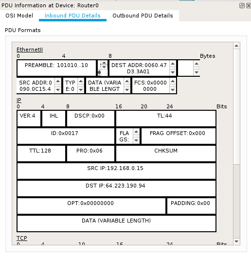

# Laboratorio 7 - NAT

> Para poder realizar éste laboratorio se realizó la siguiente modificación en el TP:
> En la tabla de ruteo de `Router0` se cambió la dirección a `10.0.0.2` en la interfaz `GigabitEthernet0/1`, para que corresponda con la dirección de enlace para la mini red asignada en `Router1`.

## Configuración NAT Estática

Se realiza la configuración **NAT** en Router 0 de la siguiente manera

```txt
Router# en
Router# config t
Router(config)# ip nat source static 192.168.0.15 200.5.224.50
Router(config)# interface GigabitEthernet0/0
Router(config-if)# ip nat inside
Router(config-if)# exit
Router(config)# interface GigabitEthernet0/1
Router(config-if)# ip nat outside
Router(config-if)# exit
```

Donde `192.168.0.15` corresponde a la máquina `Miweb` de la red local privada y `200.5.224.50` el ip estático asignado a esa máquina que actúa como servidor web. la interfaz `GigabitEthernet0/0` corresponde al enlace con el switch `Switch0` de la red interna, mientras que la interfaz `GigabitEthernet0/1` corresponde al enlace con `Router1`.

Los resultados obtenidos luego de visitar `200.5.224.50` desde la máquina servidor `Google`, son los siguientes:

**Detalles Inbound en Router0, hacia Router1**

<center>
  
</center>

> En éste momento, `Router0` ya visitó la máquina servidor `Miweb` y está realizandopor realizar la devolución del paquete a `Router1` (internet). Se observa que el pedido proviene de `192.168.0.15` (correspondiente a la máquina servidor `Miweb` de la red privada) y viaja hacia `64.223.190.94` (correspondiente a la máquina servidor Google en el área *"Internet"*)

**Detalles Outbound en Router0, hacia Router1**

<center>
  
</center>

> En contraste, ésta imagen representa la salida del paquete enviado desde la máquina `Miweb`. Se observa que el IP de origen ahora es distinto `200.5.224.50` (correspondiente a `Miweb`, ubicado en `192.168.0.15` en la red privada local), mientras que el IP de destino no cambió, sigue haciendo referencia a `64.223.190.94` (correspondiente a la máquina servidor Google en el área *"Internet"*).

## Configuración NAT Dinámica

Se realizó la configuracion de **NAT** dinámico de la siguiente manera:

+ Se creó una access list sobre la red privada local
+ Luego se define una pool utilizando direcciones públicas
+ Se define la `inside source list`
+ Se aplica sobrecarga a la source list definida anteriormente
+ Se verifican las traslaciones realizadas en la configuración

A continuación los comandos aplicados:

```txt
Router# en
Router# configure t
Router(config)# access-list 2 permit 192.168.0.0 0.0.0.255
Router(config)# ip nat pool red1 200.5.224.4 200.5.224.6 netmask 255.255.255.252
Router(config)# ip nat inside source list 2 pool red1
Router(config)# ip nat inside source list 2 pool red1 overload
Router(config)# exit
Router# show running-config
```

### Comunicación desde `PC0` hacia `Server-PT Google`

A continuación se realiza la observación sobre las cabeceras de los paquetes que se envían desde `PC0` hacia `Server-PT Google`. Se analiza específicamente el paquete al momento de pasar por `Router0`.

<center>
  
</center>

> Se puede observar la dirección de origen `192.168.0.10`, que corresponde a `PC0` en la red privada local, y dirección de destino `64.223.190.94`, correspondiente a `Server-PT Google`, no se observan cambios respecto a la interacción sin NAT.

---

<center>
  
</center>

> Esta captura muestra la salida de ése mismo paquete desde `Router0` hacia `Server-PT Google`. Se puede observar que la dirección de origen es ahora `200.5.224.5` para `PC0`, ya no es la dirección privada, sino una de las direcciones públicas asignadas en la pool `red1`.

---

### Comunicación desde `Server-PT Google` hacia `PC0`

A continuación se realiza la observación sobre las cabeceras de los paquetes que se envían dede `Server-PT Google` hacia `PC0`. Se analiza específicamente el paquete al momento de pasar por `Router0`.

<center>
  
</center>

> Se puede observar que el paquete enviado desde el servidor de Google llega a `Router0` con la dirección pública de la red privada donde se encuentra `PC0`. Esto quiere decir que el servidor no conoce nada sobre la red privada, sino que representa el destinatario como `200.5.224.5`.

---

<center>
  
</center>

> Al salir el paquete del router observamos como se realiza la traslación en la dirección de destino que antes estaba representada como `200.5.224.5` y pasa a tomar el valor `192.168.0.10`, correspondiente a `PC0` en la red privada local. Se realiza la traslación de direcciones IP en `Router0`.

### Tabla de NAT

<center>
  
</center>

<br />

> Se puede observar en la imagen una oleada de 4 pings desde `PC0` hacia `Server-PT Google`, donde las ips globales representantan direcciones publicas `200.5.224.0/24` que fueron asignadas para la red local privada `192.168.0.0/24`.
>
> Luego aparece la asignación del servidor `Miweb` con **NAT** estático, donde la dirección `192.168.0.15` representa la dirección del servior en red privada local, mientras que `200.5.224.50` representa la dirección IP pública estática que le fue asignada hacia las redes externas.
>
> Finalmente observamos la actividad de NAT, utiliando sobrecarga *(PAT - Port Address Translation)*. Se realizaron dos pedidos HTTP simultáneos con `PC0` y `PC1`, para observar la asignación de IPs y puertos (socket) a las distintas máquinas de la red.
