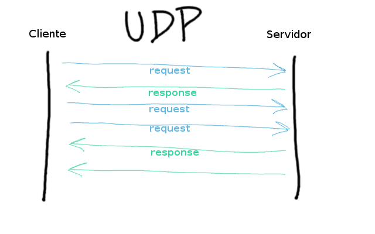
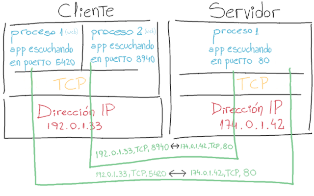

# Redes de Computadoras

> **Santiago Botta**

## Práctica V - Transporte

### Problema 1

**¿Qué es UDP? Dibuje el esquema básico del paquete. Ejemplifique para qué puede ser utilizado.**

UDP es un protocolo de nivel de transporte basado en el intercambio de datagramas.
Es un servicio no fiable, que no establece conexión entre dos partes, dado que en su cabecera proporciona información suficiente para el direccionamiento de información.
Este servicio tampoco cuenta confirmación de recibo ni control de flujo, por lo cual los paquetes enviados pueden adelantarse unos a otros. Por otro lado resulta efectivo al no incorporar retardos en la recepción de información.
Cualquier tipo de control para éste servicio debe implementarse en capas superiores.

### Problema 2

**¿Qué diferencias hay entre UDP y TCP con respecto a los servicios que ofrece? ¿En qué escenarios es preferible cada uno?**

Para poder brindar una comparativa es necesario tener una breve idea sobre TCP.
TCP es otro protocolo de nivel transporte, basado en el intercambio de segmentos.
A diferencia de UDP éste es un servicio fiable de flujo de bits entre aplicaciones, es decir que requiere establecer una conexión previa al intercambio de información de las aplicaciones. Esto hace posible el intercambio de grandes cantidades de información de manera fiable.
En cuanto a las capacidades de transporte, los segmentos TCP tiene una sobrecarga de 20 bytes por cabecera de segmento, mientras que UDP tiene solamente 8 bytes por cabecera de datagrama.
En un escenario donde es necesario contar con la información rápidamente, el protoclo UDP será más eficiente. Como ejemplo podemos tomar las videoconferencias, donde es mas importante contar con la información rápidamente que aguardar el retardo de gran flujo de bits ordenenándose o esperando paquetes perdidos para poder mostrar una imagen de alta calidad. En un servicio de transferencia de archivos será preferible el uso de TCP para evitar la pérdida de paquetes y asegurar que cada uno de los archivos representados en segmentos de flujos de bits han llegado correctamente y ordenados.

### Problema 3

**Ofrezca algunos ejemplos de parámetros de protocolo que podrían negociarse al establecerse una conexión TCP.**

Ejemplos de parámetros en un *three-way-handshake* TCP donde un servidor ha iniciado el evento `LISTEN` y un cliente envia el evento `CONNECT`.

+ Un programa de aplicación envía una solicitud `CONNECT`, en consecuencia, a nivel transporte se envía un segmento con el bit encendido para `SYN`.
+ Al recibirse una solicitud de conexión, la máquina receptora envía un paquete con los parámetros `SYN` y `ACK` encendidos.
+ El cliente emisor recibe el segmento de confirmación de pedido de conexión y envía otro segmento con el parámetro `ACK` encendido.

### Problema 4

**¿Por qué existe UDP? ¿No sería suficiente dejar que el proceso de nivel 7 simplemente envíe paquetes IP?**

El protocolo **UDP** existe para que las aplicaciones puedan enviar datagramas IP sin necesidad de establecer una conexión.
Sería suficiente para un proceso de capa aplicación enviar paquetes IP, pero cuando interactuamos con varias aplicaciones, el protocolo de transporte debería entregarnos una respuesta. En éste sentido, UDP proporciona una interfaz para el protocolo IP que permita multiplexar procesos mediante el uso de los puertos y enviar la respuesta al socket adecuado.

### Problema 5

**Explique con la ayuda de un diagrama qué se entiende por multiplexación en el nivel de transporte.**

La *multiplexación* es un proceso que ocurre a nivel transporte, que permite el uso de un mismo protocolo mediante múltiples aplicaciones.
Cada aplicación, independientemente del protocolo que utilice (HTTP, FTP, SMTP, POP3, IMAP, etc.), disponibilizará un socket (IP de host + un puerto dinámico) en el cuál espera recibir los pedidos solicitados. Esta información será utilizada en los encabezados de transporte y enviada junto con la carga útil a la capa de red.
De la misma manera, un proceso receptor en la capa de transporte aceptará datagramas/segmentos de la capa de red, chequea el puerto al que corresponde el pedido y envía los datagramas al socket provisto.

### Problema 6

Completar el siguiente cuadro para los protocolos TCP y UDP.

| Elemento del protocolo                                     | TCP | UDP |
| ---------------------------------------------------------- | --- | --- |
| Establecimiento de conexiones                              |  ✔  |  ✘  |
| Particionamiento de mensajes largos en distintos segmentos |  ✔  |  ✘  |
| Transferencia de segmentos ¹                               |  ✔  |  ✘  |
| Numeración de los segmentos                                |  ✔  |  ✘  |
| Control de flujo de nivel de transporte                    |  ✔  |  ✘  |
| Multiplexación                                             |  ✔  |  ✔  |
| Retransmisión debida a timeout                             |  ✔  |  ✔  |
| Resecuenciamiento de segmentos                             |  ✔  |  ✘  |
| Checksum de nivel de transporte                            |  ✔  |  ✔  |

¹ Es posible que tanto los segmentos TCP como los datagramas UDP sean segmentados, pero ni TCP ni UDP lo notarán, dado que es una tarea que realizará la capa de Red, de acuerdo con el MTU (Maximum Transmission Unit) designado.

### Problema 7

**A un proceso en el host 1 le ha sido asignado el port p, y a un proceso en el host 2 el port q. ¿Es posible que existan dos o más conexiones TCP entre esos dos ports al mismo tiempo?**

No, no es posible. Una vez establecida la conexión, ésta se identifica por sus puntos terminales (`host1 SEQ`, `host2 SEQ`).

### Problema 8

**¿Con qué tipo de servicio de red está diseñado para trabajar el protocolo TCP? ¿Y UDP?**

El protocolo **TCP** está diseñado para proporcionar servicios orientados a conexión, se usa comunmente en pedidos HTTP de navegadores web, conexiones FTP para transferencia de archivos, conexiones SSH, envío de correo en SMTP y recibo de correo con IMAP/POP3.
Por otro lado, **UDP** está diseñado para situaciones en las que necesitamos velocidad en el envío de información o no resulta crucial la pérdida y recupero de paquetes perdidos. Situaciones de éste estilo están representadas en conexiones entre VPNs (otros procolos se hacen cargo de los paquetes perdidos), streaming de música y audio, videoconferencias entre varios participantes, descubrimiento de dispositivos (broadcasting).

### Problema 9

**¿Por qué cree que el protocolo UDP no utiliza números de secuencia en los paquetes? ¿O sí los utiliza? ¿Con qué fin los utiliza?**

El protocolo de transporte **UDP** no utiliza números de secuencia porque no posee un mecanismo de reconocimiento o acuse de recibo, ni tampoco se encarga de ordenar series de datagramas: no existe correlación entre un paquete u otro. Dada la necesidad de partir información en distintos paquetes UDP, la numeración o identificación unívoca de información deberá estar contenida en los datos del campo `longitud de UDP` y otro protocolo de una capa superior deberá encargarse de re-empaquetar la información contenido en cada datagrama.

### Problema 10

**El protocolo UDP brinda a su nivel superior servicios:**
  **a.** ***Sin conexión / sin reconocimiento***
  **b.** Sin conexión / con reconocimiento
  **c.** Orientado a conexión
  **d.** Sin conexión u orientado a conexión
  **e.** Ninguna de los anteriores
  **f.** Cualquiera de las anteriores

El protocolo **UDP** brinda servicios *sin conexión*, no tiene three-way-handshake ni otro tipo de nexo con un host de destino para una transmisión fiable de datagramas y *sin reconocimiento*, dado que no existen flags del tipo `ACK` como sucede en **TCP**. Es decir, el host emisor no recibe notificaciones de recibo de datagramas.

### Problema 11

**¿Por qué cree que el protocolo TCP no utiliza números de secuencia en los paquetes? ¿O sí los utiliza? ¿Con qué fin los utiliza?**

El protocolo **TCP** utiliza números de secuencia en los paquetes. Durante las emisiones hacia el host receptor se utiliza un parámetro `SEQ` que representa una cantidad de bytes para que la máquina receptora decida si ya recibió los segmentos relacionados con ese número. En este sentido, es posible descartar segmentos o solicitar retransmisión de segmentos particulares.

### Problema 12

**Esta es la salida simplificada del comando netstat –an, ejecutado en un servidor. La salida ha sido modificada de manera de introducir algunos errores. Indique los errores que encuentre. Explicar.**

| Local Address         | Remote Address           | State           |
| --------------------- | ------------------------ | --------------- |
| 200.11.163.35.110     | 200.11.163.155.1454      | ESTABLISHED     |
| 200.11.163.35.25      | 200.11.163.19.1626       | TIME_WAIT       |
| 200.11.163.35.110     | 172.18.105.129.1579      | TIME_WAIT       |
| 200.11.163.35.110     | 200.114.139.238.2751     | ESTABLISHED     |
| 200.11.163.35.110     | 200.11.163.110.1924      | TIME_WAIT       |
| 200.11.163.35.110     | 200.5.114.77.3888        | ESTABLISHED     |
| 200.11.163.35.110     | 64.76.45.189.1348        | TIME_WAIT       |
| **200.11.163.35.110** | **200.5.114.77.3888**    | **ESTABLISHED** |
| 200.11.163.35.25      | 200.11.163.19.1624       | TIME_WAIT       |
| 200.11.163.35.110     | 200.11.163.135.1454      | **ESTABLISHED** |

Un error es que hay registros (marcados en negrita) que reflejan duplicidad de conexiones TCP entre la misma combinación de sockets.

### Problema 13

**A continuación se presenta una lista de paquetes capturados. Estos paquetes corresponden a más de una sesión TCP.**

  **a)** Separe las sesiones TCP, explicando el criterio usado para separarlas.
  **b)** Para cada conexión, indique los segmentos que componen el inicio y cierre de la misma.
  **c)** En una sesión ocurrió una retransmisión. Identifique el segmento original y la retransmisión.

| Paq | Origen          | Destino             | Seq         | ACK       | Length  | Flags |
| --- | --------------- | ------------------- | ----------- | --------- | ------- | ----- |
| 1   | 10.1.0.1:1234   | 10.3.2.4:80         | 1000000     |           | 0       | S     |
| 2   | 10.3.2.4:80     | 10.1.0.1:1234       | 42          | 10000001  | 0       | SA    |
| 3   | 3.14.15.92:654  | 2.71.82.81:82       | 1           |           | 0       | S     |
| 4   | 10.1.0.1:1234   | 10.3.2.4:80         | 1000001     | 43        | 0       | A     |
| 5   | 2.71.82.81:82   | 3.14.15.92:654      | 1           | 2         | 0       | SA    |
| 6   | 10.1.0.1:1234   | 10.3.2.4:80         | 1000001     | 43        | 25      | A     |
| 7   | 3.14.15.92:654  | 2.71.82.81:82       | 2           | 2         | 0       | A     |
| 8   | 3.14.15.92:654  | 2.71.82.81:82       | 2           |           | 300     |       |
| 9   | 10.3.2.4:80     | 10.1.0.1:1234       | 43          | 10000026  | 1000    | A     |
| 10  | 2.71.82.81:82   | 3.14.15.92:654      | 2           | 302       | 0       | A     |
| 11  | 10.1.0.1:1234   | 10.3.2.4:80         | 1000026     | 1043      | 0       | A     |
| 12  | 3.14.15.92:654  | 2.71.82.81:82       | 302         |           | 1000    |       |
| 13  | 10.3.2.4:80     | 10.1.0.1:1234       | 1043        | 10000026  | 1000    | A     |
| 14  | 10.1.0.1:1234   | 10.3.2.4:80         | 1000026     | 2043      | 0       | A     |
| 15  | 3.14.15.92:654  | 2.71.82.81:82       | 302         |           | 1000    |       |
| 16  | 10.3.2.4:80     | 10.1.0.1:1234       | 2043        | 10000026  | 0       | FA    |
| 17  | 2.71.82.81:82   | 3.14.15.92:654      | 2           | 1302      | 0       | A     |
| 18  | 2.71.82.81:82   | 3.14.15.92:654      | 2           |           | 0       | F     |
| 19  | 10.1.0.1:1234   | 10.3.2.4:80         | 1000026     | 2044      | 0       | FA    |
| 20  | 3.14.15.92:654  | 2.71.82.81:82       | 1302        | 3         | 0       | A     |
| 21  | 3.14.15.92:654  | 2.71.82.81:82       | 1303        |           | 0       | F     |
| 22  | 10.3.2.4:80     | 10.1.0.1:1234       | 2044        | 10000027  | 0       | A     |
| 23  | 2.71.82.81:82   | 3.14.15.92:654      | 3           | 1303      | 0       | A     |

  **a)** Las separaciones de sesiones están dadas en base a los sockets de origen y destino. La primera se da entre `10.1.0.1:1234 - 10.3.2.4:80`, mientras que la segunda entre `3.14.15.92:654 - 2.71.82.81:82`.

#### Conexión entre 10.1.0.1:1234 - 10.3.2.4:80

**b)** Los segmentos de inicio están expresados en los bloques **1**, **2** y **4**. Mientras que el cierre de sesión está dado por los bloques **16**, **19** y **22**.

| Paq | Origen          | Destino             | Seq         | ACK       | Length  | Flags |
| --- | --------------- | ------------------- | ----------- | --------- | ------- | ----- |
| 1   | 10.1.0.1:1234   | 10.3.2.4:80         | 1000000     |           | 0       | S     |
| 2   | 10.3.2.4:80     | 10.1.0.1:1234       | 42          | 10000001  | 0       | SA    |
| 4   | 10.1.0.1:1234   | 10.3.2.4:80         | 1000001     | 43        | 0       | A     |
| 6   | 10.1.0.1:1234   | 10.3.2.4:80         | 1000001     | 43        | 25      | A     |
| 9   | 10.3.2.4:80     | 10.1.0.1:1234       | 43          | 10000026  | 1000    | A     |
| 11  | 10.1.0.1:1234   | 10.3.2.4:80         | 1000026     | 1043      | 0       | A     |
| 13  | 10.3.2.4:80     | 10.1.0.1:1234       | 1043        | 10000026  | 1000    | A     |
| 14  | 10.1.0.1:1234   | 10.3.2.4:80         | 1000026     | 2043      | 0       | A     |
| 16  | 10.3.2.4:80     | 10.1.0.1:1234       | 2043        | 10000026  | 0       | FA    |
| 19  | 10.1.0.1:1234   | 10.3.2.4:80         | 1000026     | 2044      | 0       | FA    |
| 22  | 10.3.2.4:80     | 10.1.0.1:1234       | 2044        | 10000027  | 0       | A     |

#### Conexión entre 3.14.15.92:654 - 2.71.82.81:82

**b)** Para ésta sesión, el inicio está dado en los bloques **3**, **5** y **7**. Los bloques **18**, **20**, **21** y **23** denotan el cierre de sesión.

| Paq | Origen          | Destino             | Seq         | ACK       | Length  | Flags |
| --- | --------------- | ------------------- | ----------- | --------- | ------- | ----- |
| 3   | 3.14.15.92:654  | 2.71.82.81:82       | 1           |           | 0       | S     |
| 5   | 2.71.82.81:82   | 3.14.15.92:654      | 1           | 2         | 0       | SA    |
| 7   | 3.14.15.92:654  | 2.71.82.81:82       | 2           | 2         | 0       | A     |
| 8   | 3.14.15.92:654  | 2.71.82.81:82       | 2           |           | 300     |       |
| 10  | 2.71.82.81:82   | 3.14.15.92:654      | 2           | 302       | 0       | A     |
| 12  | 3.14.15.92:654  | 2.71.82.81:82       | 302         |           | 1000    |       |
| 15  | 3.14.15.92:654  | 2.71.82.81:82       | 302         |           | 1000    |       |
| 17  | 2.71.82.81:82   | 3.14.15.92:654      | 2           | 1302      | 0       | A     |
| 18  | 2.71.82.81:82   | 3.14.15.92:654      | 2           |           | 0       | F     |
| 20  | 3.14.15.92:654  | 2.71.82.81:82       | 1302        | 3         | 0       | A     |
| 21  | 3.14.15.92:654  | 2.71.82.81:82       | 1303        |           | 0       | F     |
| 23  | 2.71.82.81:82   | 3.14.15.92:654      | 3           | 1303      | 0       | A     |

**c)** La retransmisión está dada en la conexión entre `3.14.15.92:654` y `2.71.82.81:82`. El original se puede observar en el bloque **12**, mientras que la retransmisión se observa en el bloque **15**.

### Problema 14

**Indique cuantas conexiones TCP hay en esta secuencia de segmentos. Asocie cada segmento con cada una de las conexiones. Indique el criterio usado para determinar a qué conexión pertenece un segmento.**

| Paq | Orig                 | Dest                 | Flags | Seq       | Ack       | Length  |
| --- | -------------------- | -------------------- | ----- | --------- | --------- | ------- |
| 1   | 157.92.75.5:1024     | 157.92.23.3:801      | S     | 1         | ---       | 0       |
| 2   | 157.92.23.3:801      | 157.92.75.5:1024     | SA    | 1000000   | 2         | 0       |
| 3   | 190.30.132.239:3623  | 157.92.23.3:801      | S     | 42        | ---       | 0       |
| 4   | 157.92.75.5:1024     | 157.92.23.3:801      | S     | 2         | 1000001   | 0       |
| 5   | 157.92.23.3:801      | 190.30.132.239:3623  | SA    | 204       | 43        | 0       |
| 6   | 190.30.132.239:3623  | 157.92.23.3:801      | A     | 43        | 205       | 0       |
| 7   | 157.92.75.5:1024     | 157.92.23.3:801      | A     | 2         | 1000001   | 100     |
| 8   | 157.92.23.3:801      | 157.92.75.5:1024     | A     | 1000001   | 102       | 0       |
| 9   | 157.92.23.3:801      | 190.30.132.239:3623  | ---   | 205       | ---       | 40      |
| 10  | 157.92.75.5:1024     | 157.92.23.3:801      | A     | 202       | 1000001   | 100     |
| 11  | 190.30.132.239:3623  | 157.92.23.3:801      | A     | 43        | 245       | 100     |
| 12  | 157.92.23.3:801      | 157.92.75.5:1024     | A     | 1000001   | 102       | 0       |
| 13  | 157.92.75.5:1024     | 157.92.23.3:801      | A     | 302       | 1000001   | 100     |
| 14  | 157.92.23.3:801      | 190.30.132.239:3623  | A     | 245       | 143       | 0       |
| 15  | 190.30.132.239:3623  | 157.92.23.3:801      | F     | 143       | ---       | 0       |
| 16  | 157.92.23.3:801      | 157.92.75.5:1024     | A     | 1000001   | 102       | 0       |
| 17  | 157.92.75.5:1024     | 157.92.23.3:801      | A     | 402       | 1000001   | 100     |
| 18  | 157.92.23.3:801      | 190.30.132.239:3623  | A     | 245       | 144       | 0       |
| 19  | 157.92.23.3:801      | 157.92.75.5:1024     | A     | 1000001   | 102       | 0       |
| 20  | 157.92.75.5:1024     | 157.92.23.3:80       | A     | 102       | 1000001   | 100     |
| 21  | 157.92.23.3:801      | 190.30.132.239:3623  | F     | 245       | ---       | 0       |
| 22  | 157.92.23.3:801      | 157.92.75.5:1024     | A     | 1000001   | 502       | 0       |
| 23  | 157.92.75.5:1024     | 157.92.23.3:801      | A     | 502       | 1000001   | 100     |
| 24  | 157.92.23.3:801      | 157.92.75.5:1024     | A     | 1000001   | 602       | 0       |
| 25  | 157.92.75.5:1024     | 157.92.23.3:801      | FA    | 602       | 1000001   | 0       |
| 26  | 190.30.132.239:3623  | 157.92.23.3:801      | A     | 144       | 246       | 0       |
| 27  | 157.92.23.3:801      | 157.92.75.5:1024     | FA    | 1000001   | 603       | 0       |
| 28  | 157.92.75.5:1024     | 157.92.23.3:801      | A     | 602       | 1000002   | 0       |

A continuación se describen las dos (2) conexiones TCP. La primera está dada entre los sockets `157.92.75.5:1024` y `157.92.23.3:801`. La distinción de las conexiones se da por los sockets de origen y destino involucrados en cada uno de los bloques.

#### Conexión entre 157.92.75.5:1024 - 157.92.23.3:801

El inicio de la conexión está dado por los bloques **1**, **2** y **4**, mientras que la finalización comienza en el bloque **25**, continúa en el **27** y formalmente finaliza en el bloque **28**.

| Paq | Orig                 | Dest                 | Flags | Seq       | Ack       | Length  |
| --- | -------------------- | -------------------- | ----- | --------- | --------- | ------- |
| 1   | 157.92.75.5:1024     | 157.92.23.3:801      | S     | 1         | ---       | 0       |
| 2   | 157.92.23.3:801      | 157.92.75.5:1024     | SA    | 1000000   | 2         | 0       |
| 4   | 157.92.75.5:1024     | 157.92.23.3:801      | S     | 2         | 1000001   | 0       |
| 7   | 157.92.75.5:1024     | 157.92.23.3:801      | A     | 2         | 1000001   | 100     |
| 8   | 157.92.23.3:801      | 157.92.75.5:1024     | A     | 1000001   | 102       | 0       |
| 10  | 157.92.75.5:1024     | 157.92.23.3:801      | A     | 202       | 1000001   | 100     |
| 12  | 157.92.23.3:801      | 157.92.75.5:1024     | A     | 1000001   | 102       | 0       |
| 13  | 157.92.75.5:1024     | 157.92.23.3:801      | A     | 302       | 1000001   | 100     |
| 16  | 157.92.23.3:801      | 157.92.75.5:1024     | A     | 1000001   | 102       | 0       |
| 17  | 157.92.75.5:1024     | 157.92.23.3:801      | A     | 402       | 1000001   | 100     |
| 19  | 157.92.23.3:801      | 157.92.75.5:1024     | A     | 1000001   | 102       | 0       |
| 20  | 157.92.75.5:1024     | 157.92.23.3:80       | A     | 102       | 1000001   | 100     |
| 22  | 157.92.23.3:801      | 157.92.75.5:1024     | A     | 1000001   | 502       | 0       |
| 23  | 157.92.75.5:1024     | 157.92.23.3:801      | A     | 502       | 1000001   | 100     |
| 24  | 157.92.23.3:801      | 157.92.75.5:1024     | A     | 1000001   | 602       | 0       |
| 25  | 157.92.75.5:1024     | 157.92.23.3:801      | FA    | 602       | 1000001   | 0       |
| 27  | 157.92.23.3:801      | 157.92.75.5:1024     | FA    | 1000001   | 603       | 0       |
| 28  | 157.92.75.5:1024     | 157.92.23.3:801      | A     | 602       | 1000002   | 0       |

#### Conexión entre 190.30.132.239:3623 - 157.92.23.3:801

El inicio de la conexión está dado por los bloques **3**, **5** y **6**, mientras que la finalización comienza en el bloque **15**, continúa el intercambio de cierre de conexión en los bloques **18** y **21**. FInalmente finaliza en el bloque **26**.

| Paq | Orig                 | Dest                 | Flags | Seq       | Ack       | Length  |
| --- | -------------------- | -------------------- | ----- | --------- | --------- | ------- |
| 3   | 190.30.132.239:3623  | 157.92.23.3:801      | S     | 42        | ---       | 0       |
| 5   | 157.92.23.3:801      | 190.30.132.239:3623  | SA    | 204       | 43        | 0       |
| 6   | 190.30.132.239:3623  | 157.92.23.3:801      | A     | 43        | 205       | 0       |
| 9   | 157.92.23.3:801      | 190.30.132.239:3623  | ---   | 205       | ---       | 40      |
| 11  | 190.30.132.239:3623  | 157.92.23.3:801      | A     | 43        | 245       | 100     |
| 14  | 157.92.23.3:801      | 190.30.132.239:3623  | A     | 245       | 143       | 0       |
| 15  | 190.30.132.239:3623  | 157.92.23.3:801      | F     | 143       | ---       | 0       |
| 18  | 157.92.23.3:801      | 190.30.132.239:3623  | A     | 245       | 144       | 0       |
| 21  | 157.92.23.3:801      | 190.30.132.239:3623  | F     | 245       | ---       | 0       |
| 26  | 190.30.132.239:3623  | 157.92.23.3:801      | A     | 144       | 246       | 0       |

### Problema 15

**Un servidor Web cuya dirección IP es 168.83.72.5 levanta el servicio en el puerto TCP/80. En una PC cuya dirección es 157.92.27.33 alguien abre dos ventanas de un navegador y en cada una de ellas abre simultáneamente una página distinta del mismo servidor. ¿Es esto posible? ¿Cómo se distinguen los paquetes que son para una ventana de los que son para la otra?**

Cada vez que en un navegador se abre una nueva pestaña, a nivel sistema operativo un nuevo proceso se dispara y se le asigna un puerto por encima del 1024. Luego, cuando un usuario solicita conectarse una dirección, a nivel transporte se crea un socket, con la forma `IP:PUERTO` y se envía ésta combinación de `dirección ip:puerto` en el campo Origen, ya sea en forma de datagramas UDP o segmentos TCP. De ésta manera, cada vez que un usuario abre una pestaña ésta se corresponderá con un puerto, y cada petición de dirección que realice sobre la pestaña tendrá como origen una combinación `IP:puerto` única, permitiendo realizar varias conexiones desde una misma máquina a un mismo origen y distinguiendo a qué ventana deben ser entregadas gracias al campo `origen`.

### Prolema 16

**En una conexión TCP, durante el three-way handshake se produce lo siguiente: El cliente envía un segmento con el flag SYN activado y número de secuencia 100. El servidor envía un segmento con los flags SYN y ACK activados, número de secuencia 200 y número de ACK 100. ¿Qué sucede después?**

Asumo que en realidad la devolución del servidor contendría número de `ACK` con el valor `101`. El siguiente paso para el cliente sería realizar un acuse de recibo el flag `ACK` activado y número de `ACK` con valor `201`.

### Problema 17

**Se desea usar Internet para realizar llamadas telefónicas. ¿Si debe diseñar el protocolo para las llamadas, sobre que protocolo existente lo implementaría, TCP o UDP? ¿Por qué?**

Una implementación eficiente, en términos de mejorar la experiencia de llamada, se podría dar utilizando el protocolo UDP. La razón reside en que la característica de retransmisión de paquetes perdidos de TCP significaría experimentar retardos en la transmisión de datos que representan la voz de los interlocutores. Cada vez que un paquete se pierde habría que aguardar que el protocolo rechace paquetes nuevos, solicitando los perdidos, la máquina emisora volver a retransmitirlos, realizar el empaquetado en destino y recién a éste punto reproducirlos. Con una estrategia UDP, los paquetes perdidos simplemente serían ignorados y a lo sumo se experimetará un corto lapsus en las palabras transmitidas, sin embargo, la comunicación continuaría en tiempo real, dado que la máquina receptora siempre recibiría los paquetes mas recientes.

### Problema 18

**¿Cómo identifica el host A a cuál de las dos conexiones iniciadas por él corresponde la respuesta del host B?**

Host A: TCP SYN 🡆 Host B
Host A: TCP SYN 🡆 Host B
Host A 🡄 Host B: TCP SYN + ACK

El host **A** podrá distinguir a cuál de las conexiones corresponde por el campo `Destino` provisto en la cabecera del segmento TCP proveniente.

### Problema 19

**Indique cuáles de las siguientes secuencias de finalización de una conexión TCP entre dos hosts pueden ser correctas:**

**a.** SYN - SYN/ACK
**b.** SYN - ACK – SYN – ACK
**c.** SYN - SYN/ACK - ACK
**d.** SYN/ACK - ACK
**e.** SYN - ACK - SYN – ACK- SYN/ACK
**f.** SYN - ACK

Ninguna es correcta, para finalizar una conexión se utiliza `FIN` y `ACK`. Si en las opciones reemplazamos los SYN por FIN podremos observar:

**a.** `FIN` **host 1** - `FIN/ACK` **host 2**

+ *La máquina **host 1** envía un acuse de recibo de fin de conexión a **host 2**.*
+ *La máquina **host 2** recibe acuse de fin de conexión, envía aviso de fin de conexión y cerrará la conexión por time out.*

**b.** `FIN` **host 1** - `ACK` **host 2** - `FIN` **host 2** - `ACK` **host 1**

+ *La máquina **host 1** envía un aviso de fin de conexión.*
+ *La máquina **host 2** recibe el acuse de fin de conexión, aún no finaliza.*
+ *La máquina **host 2** envía aviso de fin de conexión a **host 1** y eventualmente cerrará la conexión.*
+ *La máquina **host 1** envía aviso de recibo de fin de conexión y cierra su conexión.*

**c.** `FIN` **host 1** - `FIN/ACK` **host 2** - `ACK` **host 1**

+ *La máquina **host 1** envía aviso de fin de conexión a **host 2**.*
+ *La máquina **host 2** envía acuse de recibo de fin y aviso de fin de conexión a **host 1**, queda programado el cierre de conexión.*
+ *La máquina **host 1** envía acuse de recibo de fin de conexión y cerrará.*

**d.** `FIN/ACK` **host 1** - `ACK` **host 2**

+ *No es un cierre de conexión correcto.*
+ *La máquina **host 1** envía aviso de cierre de conexión, eventualmente cerrará.*
+ *La máquina **host 2** envía acuse de recibo de conexión, pero no libera conexión.*

**e.** `FIN` **host 1** - `ACK` **host 2** - `FIN` **host 2** - `ACK` **host 1** - `FIN/ACK`

+ *El último `FIN` no sería correcto ni necesario.*
+ *Flujo similar al punto **b**.*

**f.** `FIN` **host 1** - `ACK` **host 2**

+ *No es correcto. No resulta suficiente para liberar correctamente la conexión de **host 2**.*

### Problema 20

**Ayer a la noche, Ernesto se conectó a Internet y envió email al server SMTP de su proveedor. El siguiente es el registro de los paquetes de aquella conexión:**

| Frame | Source Address      | Dest. Address       | Summary                                                                 |
| ----- | ------------------- | ------------------- | ----------------------------------------------------------------------- |
| 1     | [209.13.34.94]      | [200.61.33.5]       | **DNS:** `C` `ID=93` `OP=Query` `Name=mail.sinectis.com.ar`             |
| 2     | [200.61.33.5]       | [209.13.34.94]      | **DNS:** `R` `ID=93` `OP=Query` `STAT=OK` `NAME=mail.sinectis.com.ar`   |
| 3     | [209.13.34.94]      | odin.sinectis.com   | **TCP:** `D=25` `S=1204` `SYN` `SEQ=3405653374` `WIN=16384`             |
| 4     | odin.sinectis.com   | [209.13.34.94]      | **TCP:** `D=1204` `S=25` `SYN` `ACK=3405653375` `SEQ=2978859689`        |
| 5     | [209.13.34.94]      | odin.sinectis.com   | **TCP:** `D=25` `S=1204` `ACK=2978859690` `WIN=16560`                   |
| 6     | odin.sinectis.com   | [209.13.34.94]      | **SMTP:** `R` `PORT=1204` `220` `mail.sinectis.com.ar` `ESMTP`          |
| 7     | [209.13.34.94]      | odin.sinectis.com   | **TCP:** `D=25` `S=1204` `ACK=2978859755` `WIN=28495`                   |
| 8     | [209.13.34.94]      | odin.sinectis.com   | **SMTP:** `C` `PORT=1204` `Text Data`                                   |
| 9     | odin.sinectis.com   | [209.13.34.94]      | **TCP:** `D=1204` `S=25` `ACK=3405653376` `WIN=31740`                   |
| 10    | [209.13.34.94]      | odin.sinectis.com   | **SMTP:** `C` `PORT=1204` `Text Data`                                   |
| 11    | odin.sinectis.com   | [209.13.34.94]      | **TCP:** `D=1204` `S=25` `ACK=3405653410` `WIN=31740`                   |
| 12    | [209.13.34.94]      | odin.sinectis.com   | **SMTP:** `C` `PORT=1204` `Text Data`                                   |
| 13    | odin.sinectis.com   | [209.13.34.94]      | **TCP:** `D=1204` `S=25` `ACK=3405653426` `WIN=31740`                   |
| 14    | [209.13.34.94]      | odin.sinectis.com   | **SMTP:** `C` `PORT=1204` `Text Data`                                   |
| 15    | odin.sinectis.com   | [209.13.34.94]      | **SMTP:** `R` `PORT=1204` `mail.sinectis.com.ar` `closing connection`   |
| 16    | odin.sinectis.com   | [209.13.34.94]      | **TCP:** `D=1204` `S=25` `FIN` `ACK=3405654203` `SEQ=2978859944`        |
| 17    | [209.13.34.94]      | odin.sinectis.com   | **TCP:** `D=25` `S=1204` `FIN` `ACK=2978859780` `SEQ=3405654203`        |
| 18    | odin.sinectis.com   | [209.13.34.94]      | **TCP:** `D=1204` `S=25` `ACK=3405654204`                               |

**a)** Explique cómo se eligen esos números de puertos en los mensajes TCP.
**b)** ¿Qué realizan los frames 3, 4 y 5 en función de TCP? ¿Por qué se usan esos números de SEQ y ACK?

**a)** El puerto **1204** fue el que el sistema operativo en la máquina de Ernesto optó por disponibilizar para dicha conexión con el servidor SMTP de sinectis. El puerto **25** es el asignado por sinectis para responder pedidos **SMTP**.

**b)** Los frames **3**, **4** y **5** representan el *three-way-handshake* para establecer una conexión **TCP**. El frame **3** representa la solicitud de conexión por parte del host `209.13.34.94:1204` hacia `odin.sinectis.com:25`, con un número de secuencia `3405653374` y solicitando una vetana de tamaño `16384`. En el frame **4** se puede observar el segundo paso del handshake, donde el host `odin.sinectis.com:25` acepta el pedido de conexión enviando una suma en la secuencia recibida representada en `ACK=3405653375`, a su vez envía un número de secuencia `SEQ=2978859689`. Finalmente, en el frame **5** se observa el último paso en el establecimiento de conexión, donde el host que originalmente realizó el pedido, `209.13.34.94`, envía una suma en el acuse de recibo de la secuencia enviada por `odin.sinectis.com` con valor `ACK=2978859690`. Los números de `SEQ` son valores generados psqudo-aleatoriamente por los host que los envían y los valores `ACK` representan un acuse de recibo satisfactorio, sumando `1` a los valores recibidos en `SEQ` por cada contraparte.

### Problema 21

**En una conexión TCP iniciada entre los hosts A y B, los paquetes de A hacia B toman diferentes caminos, mientras que los de B hacia A usan el único camino disponible. El throughput final que le ofrece la red a esta conexión es suficiente para lo que se está usando pero igualmente en el host A se detectan retransmisiones. Indique ejemplos de porqué puede suceder esto.**

Lo que está sucediendo es que seguramente el host **B** está recibiendo paquetes desordenados, en consecuencia envía solicitudes de retransmisión de paquetes anteriores que el host **A** ha enviado, pero por tomar caminos distintos, algunos llegan antes que otros.
