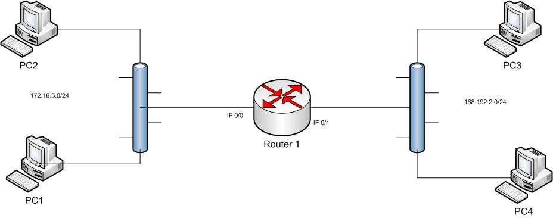
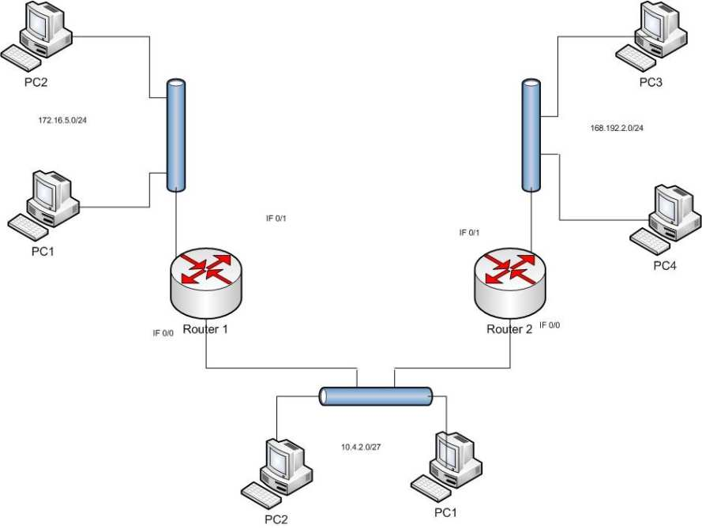
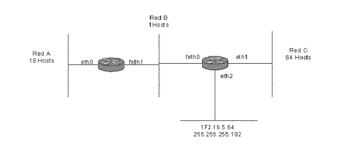

# Redes de Computadoras

<!-- markdownlint-disable MD001 MD024 -->

> 14 de Junio, 2020.
> Santiago Botta

## Práctica VI - Red

### Problema 1

**1. Si no hay disponible un servidor DHCP, indicar qué parámetros de configuración tiene que introducir el administrador de un ordenador para que éste pueda trabajar en una red con la pila de protocolos TCP/IP.**

**2. Enumerar las órdenes necesarias para comprobar que la configuración de red del ordenador es la correcta, suponiendo que está empleando el sistema operativo Unix. Indicar para qué sirve cada una de esas órdenes.**

**1.** Para organizar una red local sin utilizar DHCP será necesario asignar manualmente una dirección **IP** a cada host, una másacara y el default gateway correspondiente al router deseado. En caso que exista más de un router será necesario asignarle a cada uno de ellos las rutas estáticas necesarias para realizar saltos entre distintas redes.

**2.** Algunos de los comandos útiles para comprobar el estado de las conexiones son:

+ `ipconfig` (Windows) o `ifconfig` (Ubuntu) o `ip a` (Debian): devuelven información de las placas de red conectadas al host. En particular podemos observar que la IP de red puede tener la forma: `192.168.x.x`, por ejemplo. También podemos observar la dirección IP de la puerta de enlace predeterminada (*Default Gateway*), parecido a `192.168.x.1`. De ésta manera conocemos la dirección IP de un host.
+ Un comando útil es `ip route` (Debian), `route -n` para visualizar las entradas de la tabla de ruteo del host local.
+ Finalmente, uno de los comandos más útiles para comprobar que las comunicaciones están funcionando es mediante la órden `ping <ip-address>`. Se realizan 4 llamadas al host remoto para comprobar su capacidad de respuesta o problemas que puedan haber surgido durante el intento de comunicación.

### Problema 2

**Exprese las siguientes direcciones IP en binario e identifique la clase por defecto a la que pertenece cada una (resalte en cada caso qué parte del número binario identifica a la clase):**

| Dirección IP      | Binario                                   | Clase |
| ----------------- | ----------------------------------------- | ----- |
| 145.32.59.24      | **10**010001 00100000 00111011 00011000   | B     |
| 200.42.129.16     | **110**01000 00101010 10000001 00010000   | C     |
| 14.82.19.54       | **0**0001110 01010010 00010011 00110110   | A     |
| 163.10.200.5      | **10**100011 00001010 11001000 00000101   | B     |
| 224.1.1.25        | **1110**0000 00000001 00000001 00011001   | D     |
| 10.1.1.25         | **0**0001010 00000001 00000001 00011001   | A     |

### Problema 3

**Determine la clase, número de subred y dirección de broadcast para cada par de dirección IP y máscara de red presentadas a continuación:**

| Dirección IP      | Máscara de subred  | Clase | Número de subred   | Dirección de broadcast | Cálculos |
| ----------------- | ------------------ | ----- | ------------------ | ---------------------- | -------- |
| 170.210.17.67     | 255.255.255.192    | B     | 170.210.17.64      | 170.210.17.127         | (1)      |
| 201.222.10.60     | 255.255.255.248    | C     | 201.222.10.56      | 201.222.10.63          | (2)      |
| 15.16.193.6       | 255.255.248.0      | A     | 15.16.192.0        | 15.16.199.255          | (3)      |
| 128.16.32.13      | 255.255.255.252    | B     | 128.16.32.12       | 128.16.32.15           | (4)      |
| 153.50.6.27       | 255.255.255.128    | B     | 153.50.6.0         | 153.50.6.127           | (5)      |

#### (1) Cálculos para IP `170.210.17.67` con máscara `255.255.255.192`

##### (1) Cálculo de número de subred

```txt
IP      = 170.210.17.67     = 10101010.11010010.00010001.01000011
Máscara = 255.255.255.192   = 11111111.11111111.11111111.11000000
Subred  = 170.210.17.64     = 10101010.11010010.00010001.01000000
```

##### (1) Cálculo de dirección de broadcast

La máscara es `255.255.255.192` -> `/26`, es decir `8 + 8 + 8 + 2` bits prendidos.
Entonces existen `2 ^ 2 = 4` subredes de `2 ^ (8 - 2) = 64` hosts cada una.
La IP `170.210.17.67` pertenece a la red `170.210.17.64 - 170.210.17.127`, por lo tanto la dirección de broadcast es la `170.210.17.127`.

#### (2) Cálculos para IP `201.222.10.60` con máscara `255.255.255.248`

##### (2) Cálculo de número de subred

```txt
IP      = 201.222.10.60     = 11001001.11011110.00001010.00111100
Máscara = 255.255.255.248   = 11111111.11111111.11111111.11111000
Subred  = 201.222.10.56     = 11001001.11011110.00001010.00111000
```

##### (2) Cálculo de dirección de broadcast

La máscara es `255.255.255.248` -> `/29`, es decir `8 + 8 + 8 + 5` bits prendidos.
Entonces existen `2 ^ 5 = 32` subredes de `2 ^ (8 - 5) = 8` hosts cada una.
La IP `201.222.10.60` pertenece a la red `201.222.10.56 - 201.222.10.63`, por lo tanto la dirección de broadcast es la `201.222.10.63`.

#### (3) Cálculos para IP `15.16.193.6` con máscara `255.255.248.0`

##### (3) Cálculo de número de subred

```txt
IP      = 15.16.193.6         = 00001111.00010000.11000001.00000110
Máscara = 255.255.248.0       = 11111111.11111111.11111000.00000000
Subred  = 15.16.192.0         = 00001111.00010000.11000000.00000000
```

##### (3) Cálculo de dirección de broadcast

```txt
Subred        = 15.16.192.0       = 00001111.00010000.11000000.00000000
Wildcard Mask = 0.0.7.255         = 00000000.00000000.00000111.11111111
Broadcast     = 15.16.199.255     = 00001111.00010000.11000111.11111111
```

#### (4) Cálculos para IP `128.16.32.13` con máscara `255.255.255.252`

##### (4) Cálculo de número de subred

```txt
IP      = 128.16.32.13       = 10000000.00010000.00100000.00001101
Máscara = 255.255.255.252    = 11111111.11111111.11111111.11111100
Subred  = 128.16.32.12       = 10000000.00010000.00100000.00001100
```

Existen 64 subredes de `4 - 2 = 2` hosts cada una. La subred `128.16.32.12` es la cuarta de 64 subredes.

##### (4) Cálculo de dirección de broadcast

```txt
Subred        = 128.16.32.12      = 10000000.00010000.00100000.00001100
Wildcard Mask = 0.0.0.3           = 00000000.00000000.00000000.00000011
Broadcast     = 128.16.32.15      = 10000000.00010000.00100000.00001111
```

#### (5) Cálculos para IP `153.50.6.27` con máscara `255.255.255.128`

##### (5) Cálculo de número de subred

```txt
IP      = 153.50.6.27       = 10011001.00110010.00000110.00011011
Máscara = 255.255.255.128   = 11111111.11111111.11111111.10000000
Subred  = 153.50.6.0        = 10011001.00110010.00000110.00000000
```

Existen 2 subredes de `128 - 2 = 126` hosts cada una. La subred `153.50.6.0` es la primera de 2 subredes.

##### (5) Cálculo de dirección de broadcast

```txt
Subred        = 153.50.6.0        = 10011001.00110010.00000110.00000000
Wildcard Mask = 0.0.0.127         = 00000000.00000000.00000000.01111111
Broadcast     = 153.50.6.127      = 10011001.00110010.00000110.01111111
```

### Problema 4

**Asuma que le han asignado el bloque de direcciones 131.40.0.0/16 y necesita establecer 8 subredes.**
**1.** Se necesitan ______ dígitos binarios para definir ocho subredes.
**2.** Especifique el prefijo de red extendido para crear las 8 subredes.
**3.** Exprese las subredes en notación binaria y decimal con puntos.
**4.** Liste el rango de direcciones de hosts que pueden asignarse a la subred #3 `(131.40.96.0/19)`.
**5.** ¿Cuál es la dirección de broadcast para la subred #3? `(131.40.96.0/19)`.

**1.** Se necesitan ***19*** dígitos binarios para definir ocho subredes.

+ Bloque de direcciones: `131.40.0.0/16`.
+ La máscara es de `16` bits, el total de bits para repartir en IPv4 es `32`.
+ Bits para repartir en el bloque de direcciones de subred: `32 - 16 = 16` -> total de bits: `2 ^ 16 = 65536`.
+ Repartir en subredes de 8, o sea `2 ^ 3`, es lo más cercano a `8`. Sumar 3 bits a la máscara dada.
+ La máscara resultante es `16 + 3 = 19`, por lo tanto 19 dígitos.

**2.** El prefijo extendido para crear 8 subredes es `131.4.0.0/19`.

**3.** A continuación las notaciones de las subredes:

```txt
Red                           131.40.0.0       10000011.00101000.00000000.00000000
Máscara /16                   255.255.0.0      11111111.11111111.00000000.00000000
Máscara /19 para 8 subredes   255.255.224.0    11111111.11111111.11100000.00000000

1er subred                    131.40.0.0       10000011.00101000.00000000.00000000
2da subred                    131.40.32.0      10000011.00101000.00100000.00000000
3ra subred                    131.40.64.0      10000011.00101000.01000000.00000000
4ta subred                    131.40.96.0      10000011.00101000.01100000.00000000
5ta subred                    131.40.128.0     10000011.00101000.10000000.00000000
6ta subred                    131.40.160.0     10000011.00101000.10100000.00000000
7ma subred                    131.40.192.0     10000011.00101000.11000000.00000000
8va subred                    131.40.224.0     10000011.00101000.11100000.00000000
```

**4.** Rango de direcciones de hosts que pueden asignarse a la subred #3 `(191.40.96.0/16)`:

La tercer subred es en realidad la dada por `191.40.64.0/19`, y el rango sería:

+ `191.40.64.1 - 191.40.95.254`

La subred dada por `191.40.96.0/16` desprende el siguiente rango:

```txt
# Red aplicando másca /16
Red                           131.40.0.0      10000011.00101000.01100000.00000000
Máscara /16                   255.255.0.0     11111111.11111111.00000000.00000000
```

Rango: `131.40.0.1 - 131.40.255.254`

### Problema 5

**Asuma que le han asignado el bloque de red `200.15.17.0/24`.**

**1.** Defina un prefijo de red extendido que permita la creación de 20 hosts en cada subred.
**2.** ¿Cuál es el número máximo de hosts que pueden asignarse a cada subred?
**3.** ¿Cuál es el número máximo de subredes que pueden definirse?
**4.** Especifique las subredes de 200.15.17.0/24.
**5.** Liste el rango de direcciones de host que pueden asignarse a la subred #6 (200.15.17.192/27).
**6.** ¿Cuál es la dirección de broadcast para la subred 200.35.1.192/27?

```txt
Bloque de red asignado      200.15.17.0     11001000.00001111.00010001.00000000
Máscara /24                 255.255.255.0   11111111.11111111.11111111.00000000
```

**1.** El prefijo extendido está dado de la siguiente manera:

Se necesitan 20 hosts por red. El número más cercano a 20 para repartir hosts es 32, es decir `2 ^ 5 = 32`. Se le sumarán `5` bits a la máscara dada, de manera que será `/29`.

El prefijo entonces está dado de la forma: `200.15.17.0/29`.

**2.** Cada subred tiene tamaño `2 ^ 5 = 32`, de manera que el máximo número de hosts es de `32 - 2 = 30`.

**3.** El máximo de subredes que se pueden definir es 8, ya que `256 / 32 = 8`.

**4.** Las subredes de `200.15.17.0/27` están dadas de la siguiente manera:

```txt
Red                           200.15.17.0       11001000.00001111.00010001.00000000
Máscara /24                   255.255.255.0     11111111.11111111.11111111.00000000
Máscara /27 para 8 subredes   255.255.255.224   11111111.11111111.11111111.11100000

1er subred                    200.15.17.0       11001000.00001111.00010001.00000000
2da subred                    200.15.17.32      11001000.00001111.00010001.00100000
3ra subred                    200.15.17.64      11001000.00001111.00010001.01000000
4ta subred                    200.15.17.96      11001000.00001111.00010001.01100000
5ta subred                    200.15.17.128     11001000.00001111.00010001.10000000
6ta subred                    200.15.17.160     11001000.00001111.00010001.10100000
7ma subred                    200.15.17.192     11001000.00001111.00010001.11000000
8va subred                    200.15.17.224     11001000.00001111.00010001.11100000
```

**5** La subred dada por `200.15.17.192/27` desprende el siguiente rango de direcciones:

+ `200.15.17.193 - 200.15.17.222`
+ La dirección `200.15.17.223` es la última de ésta subred y corresponde a Broadcast.

**6** Asumo que se busca la dirección de broadcast para la subred `200.15.17.192/27`. Corresponde a la dirección `200.15.17.223`.

### Problema 6

**Dada la siguiente red: Complete la tabla con la configuración del router e implemente en el emulador de redes.**



#### Router 1

| IF                | Dirección IP      | Máscara           |
| ----------------- | ----------------- | ----------------- |
| 0/0               | 172.16.5.0        | 255.255.0.0       |
| 0/1               | 168.192.2.0       | 255.255.0.0       |

#### Tabla de Ruteo

| Destino           | Máscara           | Next Hop          |
| ----------------- | ----------------- | ----------------- |
|                   |                   |                   |

> La tabla de ruteo estático está vacía, la comunicación se da a través de `Ethernet 0/0 = 172.16.5.0/24` y `Ethernet 0/1 = 168.192.2.0/24`.
> Se adjunta el archivo `problema-6.pkt` junto con ésta práctica.

### Problema 7

**Dada la siguiente red: Complete la tabla con la configuración de los routers e implemente en el emulador de redes.**



#### Router 1

| IF                | Dirección IP      | Máscara           |
| ----------------- | ----------------- | ----------------- |
| 0/0               | 10.4.2.0          | 255.0.0.0         |
| 0/1               | 172.16.5.0        | 255.255.0.0       |

#### Tabla de Ruteo Router 1

| Destino           | Máscara           | Next Hop          |
| ----------------- | ----------------- | ----------------- |
| 168.192.2.0       | 255.255.255.0     | 10.4.2.1          |

#### Router 2

| IF                | Dirección IP      | Máscara           |
| ----------------- | ----------------- | ----------------- |
| 0/0               | 10.4.2.1          | 255.0.0.0         |
| 0/1               | 168.192.2.0       | 255.255.0.0       |

#### Tabla de Ruteo Router 2

| Destino           | Máscara           | Next Hop          |
| ----------------- | ----------------- | ----------------- |
| 172.16.5.0        | 255.255.255.0     | 10.4.2.0          |

> Se adjunta el archivo `problema-7.pkt` junto con ésta práctica.

### Problema 8

**Dada la siguiente red: Complete la tabla con la configuración de los routers e implemente en el emulador de redes, copie la configuración realizada en los routers, use una mini-red /30 para interconectar los routers 2 y 3.**

#### Router 1

| IF                | Dirección IP      | Máscara           |
| ----------------- | ----------------- | ----------------- |
| 0/0               | 10.4.2.0          | 255.0.0.0         |
| 0/1               | 172.16.5.0        | 255.255.0.0       |

#### Tabla de Ruteo Router 1

| Destino           | Máscara           | Next Hop          |
| ----------------- | ----------------- | ----------------- |
| 168.192.2.0       | 255.255.255.0     | 10.4.2.1          |

#### Router 2

| IF                | Dirección IP      | Máscara           |
| ----------------- | ----------------- | ----------------- |
| 0/0               | 10.4.2.1          | 255.0.0.0         |
| 0/1               | 90.0.0.2          | 255.255.255.252   |

#### Tabla de Ruteo Router 2

| Destino           | Máscara           | Next Hop          |
| ----------------- | ----------------- | ----------------- |
| 172.16.5.0        | 255.255.255.0     | 10.4.2.0          |
| 168.192.2.0       | 255.255.255.0     | 90.0.0.1          |

#### Router 3

| IF                | Dirección IP      | Máscara           |
| ----------------- | ----------------- | ----------------- |
| 0/0               | 90.0.0.1          | 255.255.255.252   |
| 0/1               | 168.192.2.0       | 255.255.0.0       |

#### Tabla de Ruteo Router 3

| Destino           | Máscara           | Next Hop          |
| ----------------- | ----------------- | ----------------- |
| 10.4.2.0          | 255.255.255.224   | 90.0.0.2          |
| 172.16.5.0        | 255.255.255.0     | 10.4.2.0          |

> Se adjunta el archivo `problema-8.pkt` junto con ésta práctica.

### Problema 9

**Diseñe un plan de subredes para la red 165.123.0.0/16 teniendo en cuenta que se necesitan 70 subredes y un máximo de 256 hosts por subred. Especifique la longitud del prefijo e indique los números correspondientes a cada subred.**

Se dispone del siguiente bloque: `165.123.0.0/16`, es decir, 65534 hosts disponibles para repartir en 70 redes de como **máximo** 256 hosts cada una.

A continuación se detallan las redes obtenidas, cada una cuenta con **256 hosts**, donde solo **254 son usables**.

```txt
red #1    165.123.0.0/24    |  red #25   165.123.24.0/24   |  red #49   165.123.48.0/24
red #2    165.123.1.0/24    |  red #26   165.123.25.0/24   |  red #50   165.123.49.0/24
red #3    165.123.2.0/24    |  red #27   165.123.26.0/24   |  red #51   165.123.50.0/24
red #4    165.123.3.0/24    |  red #28   165.123.27.0/24   |  red #52   165.123.51.0/24
red #5    165.123.4.0/24    |  red #29   165.123.28.0/24   |  red #53   165.123.52.0/24
red #6    165.123.5.0/24    |  red #30   165.123.29.0/24   |  red #54   165.123.53.0/24
red #7    165.123.6.0/24    |  red #31   165.123.30.0/24   |  red #55   165.123.54.0/24
red #8    165.123.7.0/24    |  red #32   165.123.31.0/24   |  red #56   165.123.55.0/24
red #9    165.123.8.0/24    |  red #33   165.123.32.0/24   |  red #57   165.123.56.0/24
red #10   165.123.9.0/24    |  red #34   165.123.33.0/24   |  red #58   165.123.57.0/24
red #11   165.123.10.0/24   |  red #35   165.123.34.0/24   |  red #59   165.123.58.0/24
red #12   165.123.11.0/24   |  red #36   165.123.35.0/24   |  red #60   165.123.59.0/24
red #13   165.123.12.0/24   |  red #37   165.123.36.0/24   |  red #61   165.123.60.0/24
red #14   165.123.13.0/24   |  red #38   165.123.37.0/24   |  red #62   165.123.61.0/24
red #15   165.123.14.0/24   |  red #39   165.123.38.0/24   |  red #63   165.123.62.0/24
red #16   165.123.15.0/24   |  red #40   165.123.39.0/24   |  red #64   165.123.63.0/24
red #17   165.123.16.0/24   |  red #41   165.123.40.0/24   |  red #65   165.123.64.0/24
red #18   165.123.17.0/24   |  red #42   165.123.41.0/24   |  red #66   165.123.65.0/24
red #19   165.123.18.0/24   |  red #43   165.123.42.0/24   |  red #67   165.123.66.0/24
red #20   165.123.19.0/24   |  red #44   165.123.43.0/24   |  red #68   165.123.67.0/24
red #21   165.123.20.0/24   |  red #45   165.123.44.0/24   |  red #69   165.123.68.0/24
red #22   165.123.21.0/24   |  red #46   165.123.45.0/24   |  red #70   165.123.69.0/24
red #23   165.123.22.0/24   |  red #47   165.123.46.0/24
red #24   165.123.23.0/24   |  red #48   165.123.47.0/24
```

### Problema 10

**Diseñe un plan de subredes para la red `190.3.54.0/24` teniendo en cuenta que se necesitan `4` subredes, una de las redes como máximo ubicará a 120 host, otra de las redes tendrá a lo sumo `60` host y luego se necesitarán dos redes más para ubicar `20` servidores en cada una de ellas. Especifique la longitud del prefijo e indique los números correspondientes a cada subred:**

```txt
Subred #0 (120 Host): 190.3.54.0/25   -> [190.3.54.0,   190.3.54.127]
Subred #1 (60 Host):  190.3.54.128/26 -> [190.3.54.128, 190.3.54.191]
Subred #2 (20 Host):  190.3.54.192/27 -> [190.3.54.192, 190.3.54.223]
Subred #3 (20 Host):  190.3.54.224/27 -> [190.3.54.224, 190.3.54.255]
```

### Problema 11

**Se quiere establecer un esquema de direccionamiento IP para la red de un viñedo que tiene oficinas en Buenos Aires y Mendoza. En BA existe un router, que conecta a 3 LANs de 20 hosts cada una, y conecta en un enlace WAN a Mendoza. En la oficina de Mendoza existe también otro router que conecta 3 LANS de 25 hosts cada una, el enlace WAN con BA y un enlace WAN al viñedo en Luján de Cuyo, donde hay un router que conecta una LAN de 10 hosts. Se dispone de la siguiente dirección IP a subnetear: 192.168.1.0/24. Diagramar la red indicando en cada segmento LAN y WAN cuál es la dirección de red IP y la dirección broadcast correspondiente.**

Se dispone del siguiente bloque: `192.168.1.0/24`.

#### Buenos Aires

+ Existen 3 LANs de 20 hosts cada una.
+ Enlace WAN a Mendoza.

```txt
#0 subred lan | dirección de red:       192.168.1.0/27    Hasta 30 hosts usables
              | dirección de broadcast: 192.168.1.31/27

#1 subred lan | dirección de red:       192.168.1.32/27   Hasta 30 hosts usables
              | dirección de broadcast: 192.168.1.63/27

#2 subred lan | dirección de red:       192.168.1.64/27   Hasta 30 hosts usables
              | dirección de broadcast: 192.168.1.95/27
```

#### Mendoza

+ Existen 3 LANs de 25 hosts cada una.
+ Enlace WAN con Buenos Aires y enlace WAN a Luján de Cuyo.

```txt
#0 subred lan | dirección de red:       192.168.1.95/27   Hasta 30 hosts usables
              | dirección de broadcast: 192.168.1.127/27

#1 subred lan | dirección de red:       192.168.1.128/27  Hasta 30 hosts usables
              | dirección de broadcast: 192.168.1.159/27

#2 subred lan | dirección de red:       192.168.1.160/27  Hasta 30 hosts usables
              | dirección de broadcast: 192.168.1.191/27
```

#### Luján de Cuyo

+ Existe 1 LAN de 10 hosts.
+ Enlace WAN con Mendoza.

```txt
#0 subred lan | dirección de red:       192.168.1.192/28  Hasta 14 hosts usables
              | dirección de broadcast: 192.168.1.207/28
```

#### Mendoza - Buenos Aires - Luján de Cuyo

```txt
#0 subred wan | dirección de red:       192.168.1.208/29  Hasta 6 hosts usables
              | dirección de broadcast: 192.168.1.215/29
```

### Problema 12

**El protocolo IP ofrece a su capa superior:**

+ ~~Un servicio orientado a conexión.~~
+ Un servicio sin conexión sin reconocimiento.
+ ~~Un servicio sin conexión con reconocimiento.~~
+ ~~Ninguna de las anteriores.~~
+ ~~Cualquiera de las anteriores.~~

El protocolo IP es un servicio no orientado a la conexión y sin reconocimiento de arribo, es decir que no es un protocolo confiable. Para lorar confiabilidad, la capa superior implementa el protocolo TCP en combinación con IP, logrando así el envío de paquetes con reconocimiento de recepción, integridad y fiabilidad. El protocolo IP se encarga únicamente de enviar un paquete a un destino a través de la mejor ruta posible, mediante técnicas de enrutamiento.

### Problema 13

**Dado el siguiente esquema de red, indicar una posible numeración IP para todos los segmentos de red presentes utilizando la red `172.16.5.0/24`.**



Esquema de segmentos de red, utilizando la red `172.16.5.0/24`. Se asume que la cantidad de hosts de cada red comtempla *host* y *broadcast*.

Teniendo en cuenta que ya está siendo utilizado el segmento `172.16.5.64/26`, se desarrolla el siguiente esquema:

```txt
#A subred     | dirección de red:       172.16.5.128/27   Hasta 32 hosts
              | dirección de broadcast: 172.16.5.160/27

#B subred     | dirección de red:       172.16.5.161/29    Hasta 8 hosts
              | dirección de broadcast: 172.16.5.168/27

#C subred     | dirección de red:       172.16.5.0/29     Hasta 64 hosts
              | dirección de broadcast: 172.16.5.63/27
```

### Problema 14

**Se necesita diseñar una red IP usando la dirección `192.168.0.0/24`. Existen tres segmentos de LAN con 14 usuarios y dos más con 20, todos estos unidos por un mismo router. Además hay dos segmentos de WAN punto a punto, donde los segmentos de LAN remotos tienen 13 y 30 usuarios respectivamente, partiendo del mismo router. Indicar el esquema de direccionamiento a implementar, graficando la red completa con los números de subred y máscara asociados a cada segmento LAN/WAN.**

Se cuenta con el bloque de direcciones dado por `192.168.0.0/24`. Se cuenta a grandes rasgos con dos redes **LAN**, de las cuales una tiene 5 subredes, la otra 2 subredes. Se necesitan:

+ 4 subredes de a lo sumo 16 hosts,
+ 3 subredes de al menos 32 hosts, y
+ una mini red para el enlace punto a punto de los segmentos **WAN**.

Se definen los siguientes esquemas:

#### Segmentos a repartir

```txt
30 hosts usables: 192.168.0.0/27 (red)   - 192.168.0.31/27 (broadcast)  Lan 1
30 hosts usables: 192.168.0.32/27 (red)  - 192.168.0.63/27 (broadcast)  Lan 1
30 hosts usables: 192.168.0.64/27 (red)  - 192.168.0.95/27 (broadcast)  Lan 2

14 hosts usables: 192.168.0.96/28 (red)  - 192.168.0.111/28 (broadcast) Lan 1
14 hosts usables: 192.168.0.112/28 (red) - 192.168.0.127/28 (broadcast) Lan 1
14 hosts usables: 192.168.0.128/28 (red) - 192.168.0.143/28 (broadcast) Lan 1
14 hosts usables: 192.168.0.144/28 (red) - 192.168.0.159/28 (broadcast) Lan 2

2 hosts usables: 192.168.0.160/30 (red)  - 192.168.0.163/30 (broadcast) Wan 1
```

#### Redireccionamiento

##### Router 1 WAN

```txt
IP: 192.168.0.161/30 (wan)
Redirección hacia 192.168.0.95/27   por 192.168.0.162/30
Redirección hacia 192.168.0.159/28  por 192.168.0.162/30
```

##### Router 2 WAN

```txt
IP: 192.168.0.162/30 (wan)
Redirección hacia 192.168.0.0/25    por 192.168.0.161/30
Redirección hacia 192.168.0.96/27   por 192.168.0.161/30
Redirección hacia 192.168.0.128/28  por 192.168.0.161/30
```


#### LAN 1

```txt
#0 subred     | dirección de red:       192.168.0.96/28    Hasta 14 hosts usables
              | dirección de broadcast: 192.168.0.111/28

#1 subred     | dirección de red:       192.168.0.112/28   Hasta 14 hosts usables
              | dirección de broadcast: 192.168.0.127/28

#2 subred     | dirección de red:       192.168.0.128/28   Hasta 14 hosts usables
              | dirección de broadcast: 192.168.0.143/28

#3 subred     | dirección de red:       192.168.0.0/27     Hasta 30 hosts usables
              | dirección de broadcast: 192.168.0.31/27

#4 subred     | dirección de red:       192.168.0.32/27    Hasta 30 hosts usables
              | dirección de broadcast: 192.168.0.63/27
```

#### LAN 2

```txt
#0 subred     | dirección de red:       192.168.0.64/27    Hasta 30 hosts usables
              | dirección de broadcast: 192.168.0.95/27

#1 subred     | dirección de red:       192.168.0.144/28   Hasta 14 hosts usables
              | dirección de broadcast: 192.168.0.159/28
```

#### WAN 1

```txt
#0 subred     | dirección de red:       192.168.0.160/30    Hasta 2 hosts usables
              | dirección de broadcast: 192.168.0.163/30
```

### Problema 15

**Supongamos que a una red de la facultad le fue asignada la dirección `157.92.26.0/24`. Existen 10 laboratorios, cada uno con su propia LAN, con no más de 25 hosts cada uno. La secretaría, la dirección y las oficinas se llevan otras 40 direcciones de host más, asignados en la misma LAN. Suponiendo que todas las redes están unidas por un único router, indicar un esquema de direccionamiento con la máscara de red correspondiente asumiendo que sólo 5 laboratorios tendrán acceso a Internet además de la secretaría, la dirección y las oficinas.**

Se cuenta con el bloque de direcciones `157.92.26.0/24`.

Se necesita:

+ 1 red de hasta 64 hosts para la secretaría, la dirección y las oficinas.
+ 5 redes de hasta 32 hosts para distintas LAN de laboratorios con acceso a internet.
+ 5 redes de hasta 32 hosts para distintas LAN de laboratorios sin acceso a internet.

#### Reparto de direcciones

```txt
62 hosts usables:   157.92.26.0/26        | secretaría, la dirección y las oficinas

30 hosts usables:   157.92.26.64/27       |
30 hosts usables:   157.92.26.96/27       |
30 hosts usables:   157.92.26.128/27      | Laboratorios con acceso a Internet
30 hosts usables:   157.92.26.160/27      |
30 hosts usables:   157.92.26.192/27      |

30 hosts usables:   192.168.0.0/27        |
30 hosts usables:   192.168.0.32/27       |
30 hosts usables:   192.168.0.64/27       | Laboratorios sin acceso a Internet
30 hosts usables:   192.168.0.96/27       |
30 hosts usables:   192.168.0.128/27      |
```

#### Router

```txt
0/0       157.92.26.1

0/1       157.92.26.65
1/0       157.92.26.97
1/1       157.92.26.129
0/0/0     157.92.26.161
0/0/1     157.92.26.193

0/1/0     192.168.0.1
0/1/1     192.168.0.33
1/0/0     192.168.00.65
1/0/1     192.168.0.97
1/1/0     192.168.0.129
```

### Problema 16

**Un router presenta la siguiente tabla de ruteo:**

| Address/mask    | Next hop      |
| --------------- | ------------- |
| 135.46.56.0/22  | Interface 0   |
| 135.46.60.0/22  | Interface 1   |
| 192.53.40.0/23  | Router 1      |
| Default         | Router 2      |

**¿Qué hace el router cuando recibe un paquete con destino a las siguientes direcciones?**

**a)** `135.46.52.2`
**b)** `135.46.52.3`
**c)** `135.46.52.4`
**d)** `192.53.25.1`
**e)** `192.53.40.7`
**f)** `192.53.56.7`

Teniendo en cuenta el siguiente esquema,

```txt
#0 red  135.46.56.0/22    | red         135.46.56.0/22    1022 hosts
                          | broadcast   135.46.59.255

#1 red  135.46.60.0/22    | red         135.46.60.0/22    1022 hosts
                          | broadcast   135.46.63.255

#2 red  192.53.40.0/23    | red         192.53.40.0/23    510 hosts
                          | broadcast   192.53.41.255
```

se identifican los siguientes direccionamientos de ruteo:

**a)** No existe red declarado explícitamente para la dirección `135.46.52.2`, por lo tanto el router direcciona el paquete por Default a **Router 2**.
**b)** Para la dirección `135.46.52.3` sucede lo mismo que en el punto **a**.
**c)** Para la dirección `135.46.52.4` sucede lo mismo que en los puntos **a** y **b**.
**d)** Para la dirección `192.53.25.1` sucede lo mismo que en los puntos **a**, **b** y **c**.
**e)** Cuando el router recibe la dirección `192.53.40.7`, determina que se encuentra dentro del rango de la red #2, por lo tanto el paquete es direccionado hacia *Router 2**.
**f)** Para la dirección `192.53.56.7` sucede lo mismo que en los puntos **a**, **b**, **c** y **d**.

### Problema 17

**Un router presenta la siguiente tabla de ruteo:**

| Address/mask   | Next hop    |
| -------------- | ----------- |
| 135.46.56.0/25 | Interface 0 |
| 135.46.60.0/22 | Interface 1 |
| 192.53.40.0/23 | Interface 1 |

**¿Qué hace el router cuando llega un paquete con destino a las siguientes direcciones?**

**a)** `135.46.63.10`
**b)** `192.53.256.1`
**c)** `200.11.120.5`
**d)** `135.46.56.130`
**e)** `192.53.40.7`

Teniendo en cuenta el siguiente esquema,

```txt
#0 red  135.46.56.0/25    | red         135.46.56.0/25    126 hosts
                          | broadcast   135.46.56.127

#1 red  135.46.60.0/22    | red         135.46.60.0/22    1022 hosts
                          | broadcast   135.46.63.255

#2 red  192.53.40.0/23    | red         192.53.40.0/23    510 hosts
                          | broadcast   192.53.41.255
```

se identifican los siguientes direccionamientos de ruteo:

**a)** Cuando el router recibe la dirección `135.46.63.10`, determina que se encuentra dentro del rango de la red #1, por lo tanto el paquete redireccionado por **Interface 1**.
**b)** El router no puede manejar la dirección `192.53.256.1`, ya que no se encuentra en su tabla de ruteo. El host emisor recibirá un mensaje del estilo: `Destination Host Unreachable`.
**c)** Para la dirección `200.11.120.5` sucede lo mismo que en el punto **b**.
**d)** Para la dirección `135.46.56.130` sucede lo mismo que en los puntos **b** y **c**, dado que la red #0 tiene un rango muy corto como para contemplar esa IP: no existe información en la tabla de ruteo para manejar esa dirección.
**e)** Cuando el router recibe la dirección `192.53.40.7`, determina que se encuentra dentro del rango de la red #2, por lo tanto el apquete es redireccionado por **Interface 1**.

### Problema 18

**Explicar que hace la implementación de IP de un host que recibe un mensaje ICMP “TTL excedido en tránsito”.**

Un datagrama IP contiene un campo `TTL` (Time To Live), que es inicializado con algún valor numérico en el dispositivo de origen. Cuando es enviado a alguna red, durante cada contacto con un router, éste revisa el valor de ése campo y, en caso de ser mayor a `0`, simplemente lo decrementa y lo envía al siguiente salto (puede ser una red, u otro router). Cuando un router detecta que el campo alcanzó el valor `0`, éste crea un mensaje **ICMP** *(Internet Control Message Protocol)* indicando que el tiempo de tránsito ha expirado, y lo envía al dispositivo de origen.

### Problema 19

**En un IP traceroute que hace el host A hasta un host B distante en Internet se presenta la siguiente salida:**

```txt
...
8       175 ms 177 ms 169 ms      144.232.14.29
9       170 ms 170 ms 169 ms      144.232.14.122
10      172 ms 174 ms 174 ms      144.232.20.155
11      172 ms 172 ms 172 ms      144.223.246.74
12      173 ms 172 ms 172 ms      209.85.130.14
13      174 ms 185 ms 188 ms      72.14.236.200
14      173 ms 172 ms 172 ms      209.85.130.14
15      174 ms 185 ms 188 ms      72.14.236.200
16      173 ms 172 ms 172 ms      209.85.130.14
17      174 ms 185 ms 188 ms      72.14.236.200
...
```

**¿Qué problema observa?**

A partir de la redirección desde la dirección `144.223.246.74`, dos routers empiezan a enviarse el mismo paquete entre sí. La comunicación en loop se observa a partir de la línea 12.
