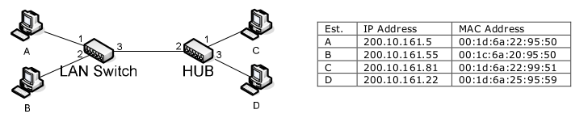
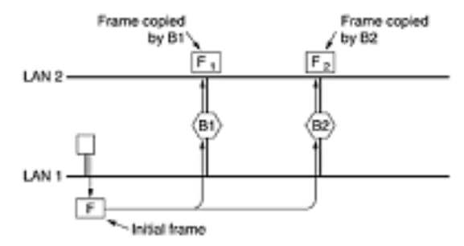

# Redes de Computadoras

<!-- markdownlint-disable MD001 MD024 -->

> 27 de Junio, 2020.
> Santiago Botta

## Práctica VII - Lan, Enlaces, Pap

### Ejercicio 1

**¿Qué empresa fabrica el adaptador Ethernet (IEEE 802.3) de la computadora que usted usa
normalmente? Determine cuál es el prefijo (OUI) de la dirección asignado a este fabricante.**

En mi caso, no poseo un adaptador Ethernet. El adaptador utilizado en mi notebook fue fabicado por la empresa Intel, bajo el estándar `IEEE 802.11` (Wireless, soportando frecuencias `2.4Ghz` y `5.8Ghz`).

Mas información sobre el adaptador:

```bash
lspci -v
02:00.0 Network controller: Intel Corporation Wireless 8260 (rev 3a)
        Subsystem: Intel Corporation Wireless 8260
        Flags: bus master, fast devsel, latency 0, IRQ 129
        Memory at ef000000 (64-bit, non-prefetchable) [size=8K]
        Capabilities: <access denied>
        Kernel driver in use: iwlwifi
        Kernel modules: iwlwifi
```

El prefijo OUI (*Organizationally unique identifier*) es un número de 24 bits que identifica unívocamente al fabricante (son los primeros 3 octetos, o seis caracteres hexadecimales, del valor de MAC address). El valor designado a mi MAC address en sus primeros tres octetos es el `b8:8a:60`, que corresponde a la compañia **Intel Corporate**.

### Ejercicio 2

**El algoritmo para el cálculo del retardo para la transmisión en `CSMA/CD` es el siguiente:**

```ruby
if intentos <= 16 then
begin
  k := min(intentos, 10);
  r := random(0, (2^k)-1);
  retardo := r * ranura_de_tiempo;
  intentos := intentos + 1;
end;
```

**donde `r` es un número entero generado de manera aleatoria a partir de una función de distribución uniforme.**

1. **¿Qué relación encuentra entre el número de colisiones que sufre un transmisor y el tiempo que deberá esperar para intentar retransmitir una trama?**
2. **¿Qué tipo de prioridad implícita genera esto?**
3. **¿Qué ocurre en el protocolo si intentos es mayor que 16? ¿Porqué existe esta cota superior?**

> CSMA/CD (*Carrier sense multiple access with collision detection*)

1. Se puede observar que el tiempo de espera para los intentos de transmisión está indirectamente afectado por la cantidad de intentos, como se indica en el cálculo de `r`, que determina (*parcialmente*) el tiempo de retardo. No quiere decir que a más intentos incrementará el tiempo de retardo, dado que la aleatoreidad se da entre el valor `0` y el resultado de otro cálculo que involucra a `r`.
2. Si bien la aleatoreidad de la operación determina cierto grado de flexibilidad en el tiempo de retardo, se puede observar que existe más posibilidad de que el tiempo de retardo sea mayor a medida que el número de intentos de transmisión aumenta.
3. Existe una cota superior para no intentar retransmitir una trama por tiempo indefinido. Se realizan 16 intentos, si el tiempo de retardos calculado no es suficiente se descarta y no se vuelve a reintentar.

### Ejercicio 3

**Analizar la veracidad de la siguiente afirmación:**
*"En MAC 802.3 (CSMA/CD), si una trama es transmitida al medio físico sin colisiones puede asegurarse que la subcapa receptora la entrega correctamente a su capa superior"*

No. CSMA/CD es un sistema que detecta colisiones durante las tramas, pero no evita que hayan sido corrompidas en el transcurso por otros factores. Si una trama está corrupta, el chequeo de paridad o *Cycle Redundancy Check*, (ubicado en los últimos 4 bytes de la trama) no será positivo y la trama se descartará y no podrá ser despachada a la subcapa receptora. Asimismo la trama puede no haber sufrido colisiones pero otros factores evitaron su entrega a destino. Algunas de las causas de éstos fenómenos pueden ser:

+ reflexiones de señales: causados por cables mal formados, no terminados, impedancia.
+ ruido eléctrico: causado por luz fluorescente, redes eléctricas, rayos X.
+ malfuncionamiento de hardware

> Fuente: https://www.liveaction.com/docs/glossary/ethernet-ieee-802-3/frame-corruption/

### Ejercicio 4

**Dentro de un segmento de `LAN 802.3` un host envía a otro un mensaje de nivel de aplicación. Si uno de los frames Ethernet llega al destino y luego del chequeo del CRC es descartado. ¿Qué sucede con el frame original? ¿Y con el mensaje de nivel de aplicación?**

En cuanto al mensaje a nivel aplicación. El software utilizado determinará qué hace cuando no recibe una respuesta. Recordemos que en la capa de transporte es en el software utilizado en la capa aplicación donde reside la responsabilidad de realizar una acción frente al comportamiento (respuesta/sin respuesta) del protocolo de transporte.
Llegado el caso en el que un frame fue descartado, las acciones dependeran de los protocolos que se estén utilizando, por ejemplo:

+ Ethernet y otros protocolos de la `IEEE 802`: no especifican una acción específica de retransmisión, la trama es directamente descartada.
+ TCP: identifica pérdida de segmentos, los cuales contienen paquetes IP y éstos están encapsulados en tramas. De ésta manera los segmentos perdido son retransmitidos, ls paquetes IPs encapsulados nuevamente y las tramas generadas una vez mas para enviarse a través del medio físico.

### Ejercicio 5

**En una LAN FastEthernet (IEEE 802.3u) se pueden usar conexiones full-duplex tanto sobre UTP como sobre fibra óptica. ¿Porqué es posible esto? ¿Qué significa full-duplex cuando se trata de Ethernet?**

Cuando hablamos de *full dúplex* nos referimos a que el tráfico puede ir en ambas direcciones al mismo tiempo.

**Incompleto...**

### Ejercicio 6

**Explique la salida del siguiente comando realizado en una PC conectada a una red local.**

```txt
arp -an

(200.10.166.41) at 00:13:20:3a:4a:ec on fxp0 [ethernet]
(200.10.166.51) at 00:03:47:c2:ef:17 on fxp0 [ethernet]
(200.10.166.53) at 00:50:04:b2:b1:57 on fxp0 [ethernet]
(200.10.166.58) at 00:07:e9:88:bb:ba on fxp0 permanent [ethernet]
(200.10.166.62) at 00:06:28:f9:e9:c0 on fxp0 [ethernet]
(200.10.166.120) at 00:0f:66:07:b3:90 on fxp0 [ethernet]
(200.10.166.160) at 00:c0:49:d6:4e:ac on fxp0 [ethernet]
(200.10.166.207) at 00:04:23:46:b9:a5 on fxp0 [ethernet]
(200.10.166.209) at 00:c0:49:a8:2a:9c on fxp0 [ethernet]
```

El comando `arp -an` se utiliza para mostrar la tabla completa de cache de ARP. En ésta tabla podemos observar las relaciones entre **IP** y **MAC address**.
En todos los casos, las relaciones entre IP y MAC Address se realizaron de forma dinámica, es decir, la relación se obtuvo luego de un flujo satisfactorio de resoluciones **ARP**, excepto en el caso de la relacion `200.10.166.58 at 00L07:e9:88:bb:ba` (línea 5). En éste caso, la relación es estática y está determinada por la palabra `permanent`. Estas entradas son administradas generalmente con herramientas de software como ésta: `arp` y se mantienen por tiempo indefinido, a diferencia de las relaciones dinámicas que caducan luego de un tiempo determinado.

### Ejercicio 7

**Explique porqué es razonable que cada entrada de la tabla ARP expire después de 10-15 minutos.**
**Explique los problemas que ocurren si el valor del timeout es demasiado pequeño o demasiado grande.**

La tabla de relaciones dinámicas de ARP debe expirar cada una cantidad de tiempo acotada. La razón se debe simplemente porque no podemos asumir que las máquinas, la placa de red o la dirección IP de una máquina van a persistir sin cambios por la eternidad. Si las tablas no expiraran y debemos reemplazar la placa de red de una de las máquinas, en la tabla quedaría un registro de una **MAC address** que ya no existe con una dirección **IP**. No solamente estaríamos manteniendo un registro que no se utilizará de una **MAC address** que ya no funciona, sino que además hay una direccion **IP** formando parte de esa relación. Si quisiéramos asignar esa IP a otra máquina podríamos tener problemas. Por ésta razón es necesario actualizar cada cierta cantidad de tiempo el estado de relaciones **MAC address** - **IP** de la red.

Esta cantidad de tiempo no debe ser trivial. Si el tiempo asignado es muy grande deberíamos esperar mucho tiempo hasta que la tabla de relaciones se complete cuando conectamos nuevas máquinas a la red. Si la cantidad de tiempo es mucho menor tendríamos mayor cantidad de tráfico de resoluciones ARP y posiblemente sea innecesario realizar éstas resoluciones en un intervalo tan corto de tiempo: una conexión de una nueva máquina cada 10 minutos parece ser una tarea muy poco común.

### Ejercicio 8

**Si a un switch se le presenta un mensaje con dirección MAC de origen desconocida, ¿Qué hace? ¿Y con dirección MAC de destino desconocida?**

Cuando a un switch se le presenta una dirección MAC de origen desconocida, simplementa la almacena en su tabla de **MAC address** y la asocia al puerto por el que la señal llegó (Ejemplo: `FastEthernet 0/0`). Una señal será emitida a una **MAC address**, y ésta posiblemente sea nueva para el dispositivo switch. En ese caso, el switch enviará éste pedido a ***todas las direcciones desconocidas*** hasta el momento. Si recibe un acuse de recibo de ése pedido, entonces la **MAC addres** que respondió será asociada al puerto que se utilizó para recibir esa señal.

**Dada una LAN con un switch L2 que une 4 hosts (H1, H2, H3, y H4), se envían frames, en este orden:**

`H1 --> H2 ; H4 --> H3 ; H2 --> H1 ; H1 --> H3 ; H3 --> H1`

**Sabiendo que la tabla de forwarding del switch se encuentra vacía, diga si los siguientes frames son enviados directamente a destino por el switch o son transmitidos por todos los puertos (broadcast). Indique también los cambios en la tabla de forwarding del switch, asumiendo que las entradas no expiran.**

Dados los anteriores frames, el dispositivo switch ya realizó mapeos suficientes para relacionar los 4 puertos a las **MAC address** correspondientes. Por lo tanto, los siguientes frames que se envíen no serán por broadcast, sino que viajarán a la **MAC address** de destino directamente.

> No entiendo qué cambios hay que realizar en la tabla de forwarding. Cada host ya está relacionado con el puerto correspondiente del switch, hasta que el dispositivo decida expirar los datos en memoria.

### Ejercicio 10

**Se tiene una LAN con tres hosts (H1, H2 y H3), con MAC address M1, M2 y M3 y direcciones IP I1, I2 e I3 respectivamente. H1 desea determinar si H2 esta funcionando. Para ello piensa enviar un mensaje ICMP echo request. Explique la secuencia de paquetes emitidos por H1, H2 y H3, suponiendo que no hay problemas y H2 responderá normalmente. No necesita entrar en detalles de la capa de enlace, pero debería explicar cualquier mensaje enviado sobre ésta. Detalle direcciones de origen y destino de nivel 2 y 3.**

No se especifica qué dispositivo conecta la supuesta **LAN** entre los hosts H1, H2 y H3. Se asume que un switch interconecta los hosts y que ninguno ha interactuado con los demás hasta el momento.

1. `H1` envía un mensaje `ARP` al dispositivo switch con su propia **MAC address** (M1), su IP `I1` e IP de destino `I2`
2. El dispositivo switch almacena la relación de IP y mac adderss de H1 y luego envía mensajes `ARP` a todos los demás hosts (`H2` y `H3`) de su red, porque no conoce a ninguno aún.
3. `H3` no responde
4. `H2` responde a switch con su IP `I2` y su **MAC address** en otro mensaje `ARP`, junto con la dirección IP de destino `I1`. A su vez, almacena en su tabla de ARP la relación IP `I1` con MAC address `M1`.
5. El dispositivo Switch almacena la **MAC address** de `H2` relacionada con el puerto por el que llegó la señal.
6. El dispositivo switch responde a `H1` con la **MAC address** del IP que solicitó en un mensaje `ARP`.
7. `H1` almacena en su cache de `ARP` la relación entre el IP y **MAC address** de destino que solicitó (`H2`)
8. `H1` envía un mensaje `ICMP` al switch con IP `I2`
9. El dispositivo switch envía el mensaje `ICMP` directamente a `H2`, ya que ya conoce la relación IP - MAC address de `H2`.
10. `H2` contesta el mensaje `ICMP` con la dirección IP de destino `I1` y MAC address de destino `M1`.
11. El dispositivo switch re-envía directamente el mensaje `ICMP` a `M1`, que corresponde a `H1`, porque ya conoce la relación puerto - MAC address.
12. `H1` recibe el acuse de ping desde `H2`.

### Ejercicio 11

**Se tiene una red ethernet con cuatro estaciones, un LAN switch y un hub.**

<center>
  
</center>

**Suponiendo que la tabla de switching del LAN Switch se encuentra vacía, que las tablas ARP de las estaciones también se encuentran vacías, y que A envía un paquete IP a B:**

**a)** Detallar la tabla de switching posterior al envío de ese paquete IP.
**b)** Detallar las tablas ARP de todas las estaciones.
**c)** Detallar a qué estaciones llega el paquete IP (aunque no sea aceptado).

**a)** A continuación se detalla la tabla de switching que se desprende de la comunicación entre `A` y `B`.

| Vlan  | Mac Address         | Type    | Ports |
| ----- | ------------------- | ------- | ----- |
| 1     | 00:1d:6a:22:95:50   | Dynamic | 1     |
| 1     | 00:1c:6a:20:95:50   | Dynamic | 2     |

**b)** A continuación se detallan las tablas ARP de todas las estaciones

#### Host A

```txt
Internet Address      Physical Address      Type
200.10.161.55         00:1c:6a:20:95:50     dynamic
```

#### Host B

```txt
Internet Address      Physical Address      Type
200.10.161.5          00:1d:6a:22:95:50     dynamic
```

#### Host C

```txt
No ARP Entries Found
```

#### Host D

```txt
No ARP Entries Found
```

**c)** Previo al mensaje `ICMP`, Host `A` envía un mensaje `ARP` al switch, que aún tiene su tabla de mac address vacía, de modo que éste mensaje es reenviado a todos los demás hosts: `Host B` y `Hub`. De modo que el Hub a su vez reenvía el mensaje a `Host C` y `Host D`, aunque éstos mensajes sean rechazados, dado que la mac address de destino pertenece a `Host B`.

### Ejercicio 12

**Para aumentar la confiabilidad, algunos sitios utilizan dos o más switches en paralelo entre LANs, como se muestra en la figura. B1 y B2 son los LAN switches.**

<center>
  
</center>

**Explique cómo se maneja el envío de un frame (F) con destino desconocido (e.g. los switches no lo tienen en sus tablas de forwarding).**

> Se asume que existe un switch en cada LAN y los switches intermedios.

Un host envía un frame hacia otro de su LAN, especificando únicamente la dirección IP en un paquete `ARP`. Este es enviado al switch de la red, éste a su vez hace broadcasting sobre todos sus hosts para que alguna máquina lo reciba, hasta este punto desconoce el destino. Entre estos hosts se incluyen los switches intermedios entre las LAN. Estos switches hacen a su vez broadcasting sobre sus hosts para que aluna máquina responda. Una máquina con esa IP asignada responde con su mac address, de manera que el switch pueda asignarla a su tabla de mac address y relacionarla con la interfaz o puerto a la que éste host que actuó como receptor está conectado.

### Ejercicio 13

**Se tienen 2 cables de 300Km ambos transportando información a una tasa de 1544 Mbps. La velocidad de propagación de uno de ellos es de 2/3 de la velocidad de la luz mientras que en el otro es 1⁄2 de la velocidad de la luz. ¿Cuántos bits “entran” en cada cable?**

> Ayuda: Velocidad de la luz= 300.000 Km/s. Leer de Wikipedia “"Bandwidth-delay product".

***Pendiente de entrega............***

### Ejercicio 14

**Suponga que se instala un enlace punto-a-punto de 100Mbps entre la Tierra y una nueva colonia en la Luna. La distancia entre la Luna y la Tierra es de aproximadamente 386243 kilómetros, y los datos atraviesan el enlace a la velocidad de la luz (300000 kilómetros por segundo).**

+ Calcule el RTT (Round-Trip Time) del enlace.
+ Usando el RTT como delay, calcule el producto delay x bandwith para el enlace.
+ ¿Cuál es el significado del producto delay x bandwith calculado en el punto anterior?
+ Una cámara en la base lunar toma fotografías de la Tierra y las guarda en formato digital en un disco. Suponga que el Control de Misión en la Tierra desea descargar la última imagen que es de 25 MB. ¿Cuál es el tiempo mínimo que puede transcurrir entre el momento en que se inicia el pedido del dato y finaliza la transferencia?

***Pendiente de entrega............***

---

> Otras fuentes:
> + https://www.youtube.com/watch?v=_b4dXKB8Pt8
> + https://en.wikipedia.org/wiki/Bandwidth-delay_product
